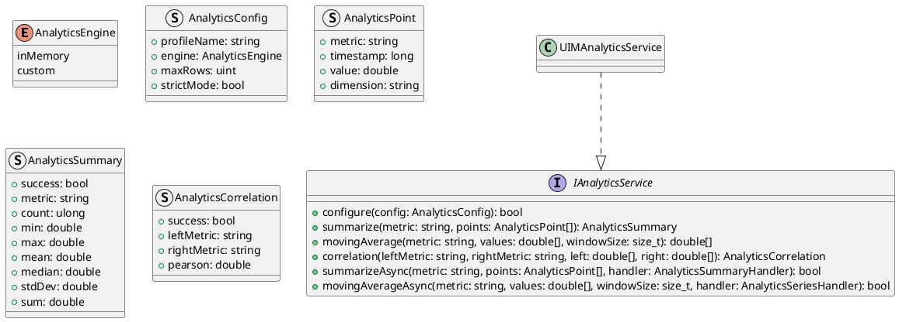
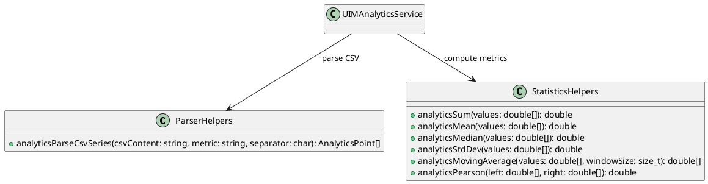
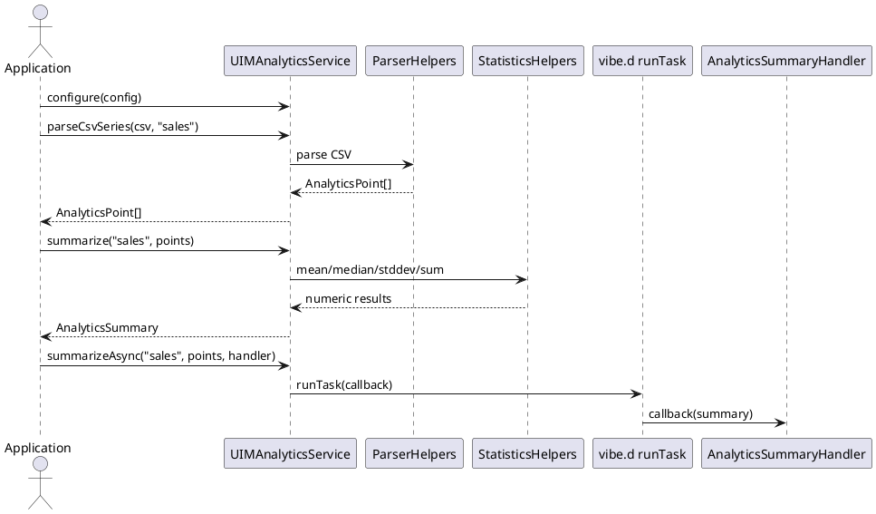

# UIM-ANALYTICS UML Description

## Overview

The UIM-ANALYTICS library provides a compact architecture for analytics workflows in D. It combines typed service contracts, parser/statistics helpers, model constructors, and async orchestration using vibe.d.

## Core Types

## Helper Layer

## Sequence

