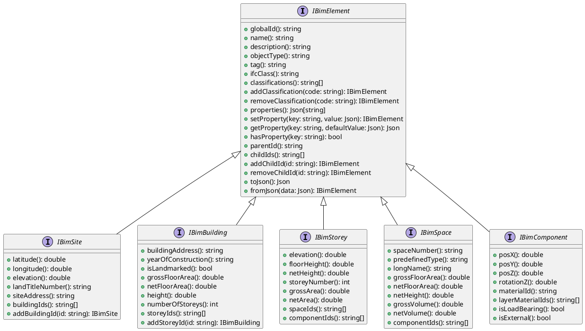
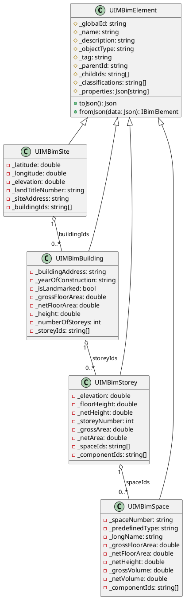
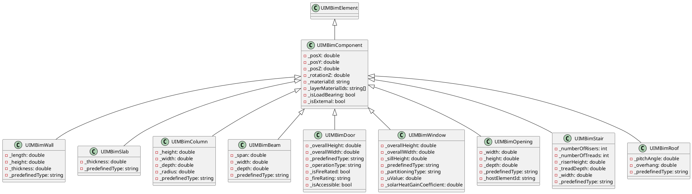
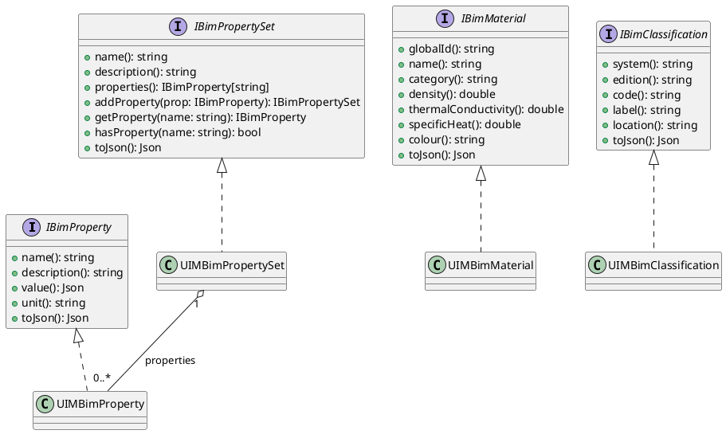
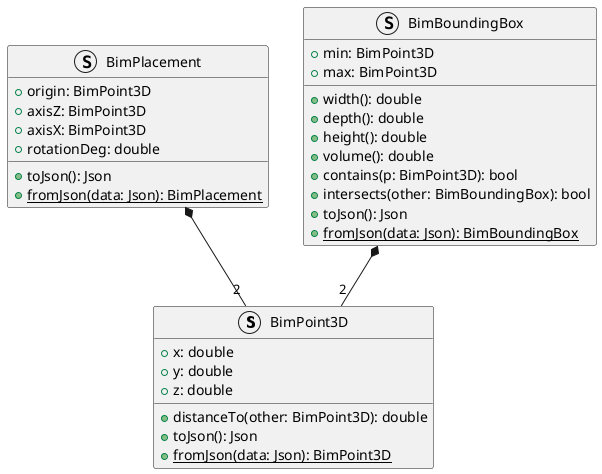
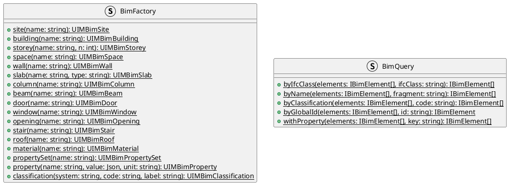
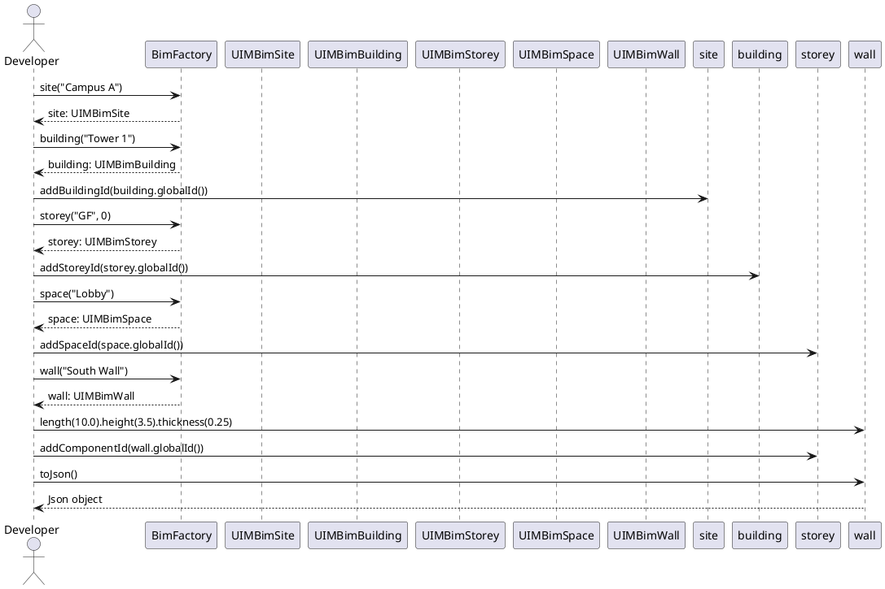

/****************************************************************************************************************
* Copyright: © 2018-2026 Ozan Nurettin Süel (aka UI-Manufaktur UG *R.I.P*) 
* License: Subject to the terms of the Apache 2.0 license, as written in the included LICENSE.txt file. 
* Authors: Ozan Nurettin Süel (aka UI-Manufaktur UG *R.I.P*)
*****************************************************************************************************************/

# UIM-BIM UML Description

## Overview

`uim-bim` implements a domain model aligned with the **IFC 4.3** schema. The architecture follows a layered design: interfaces define contracts, model/component classes provide implementations, and helper structs (`BimFactory`, `BimQuery`) provide entry points for library consumers.

---

## 1. Interfaces

---

## 2. Spatial Hierarchy

---

## 3. Building Components

---

## 4. Properties, Materials, and Classifications

---

## 5. Geometry Primitives

---

## 6. Helper Layer

---

## 7. Sequence: Building a Model

