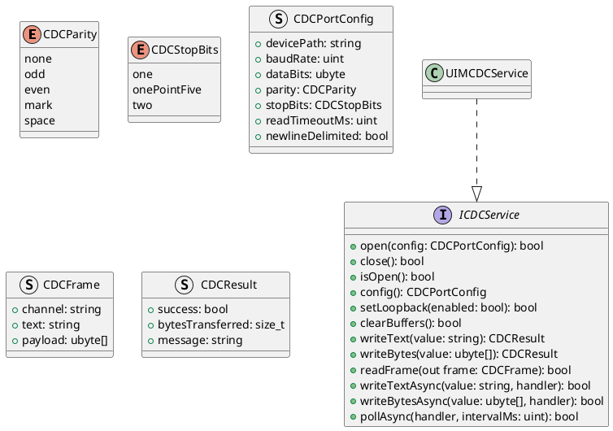
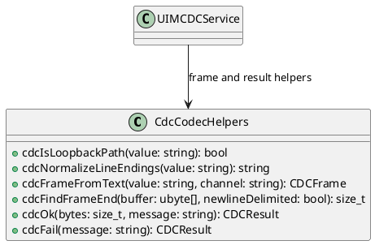
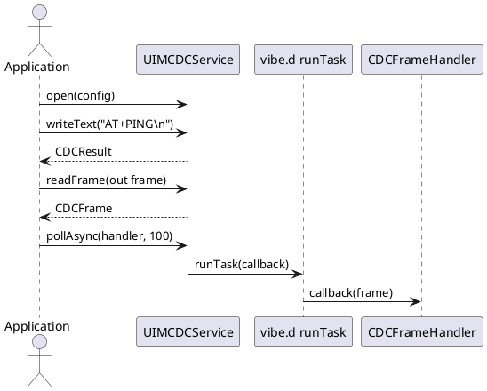

# UIM-CDC UML Description

## Overview

UIM-CDC provides a compact architecture for Virtual COM Port / USB CDC message exchange with synchronous and asynchronous operations.

## Core Types

## Helper Layer

## Sequence

