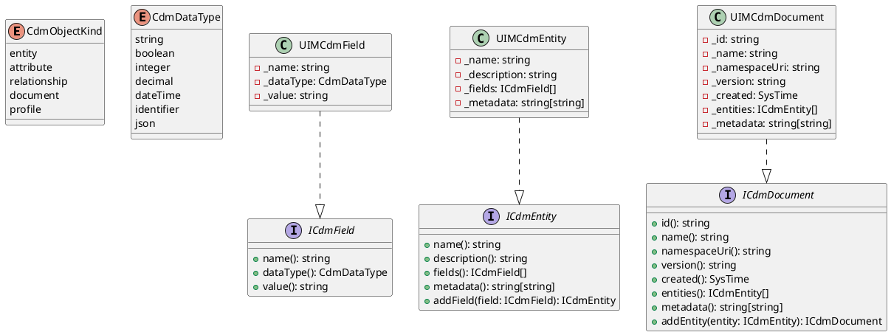
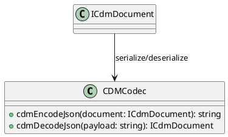
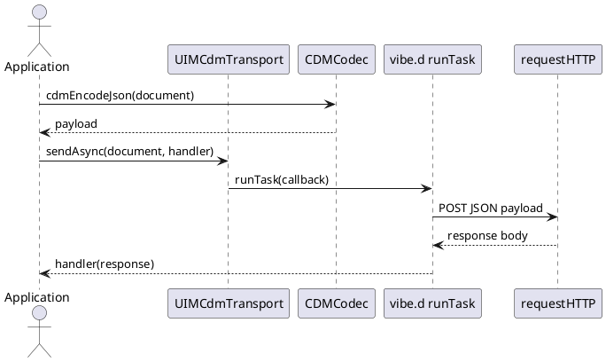

# UIM-CDM UML Description

## Overview
The UIM-CDM library models a simple Common Data Model in D and provides a JSON codec plus an async HTTP transport facade. The transport uses vibe.d task scheduling to dispatch responses without blocking the caller.

## Core Types

## Codec Layer

## Sequence

