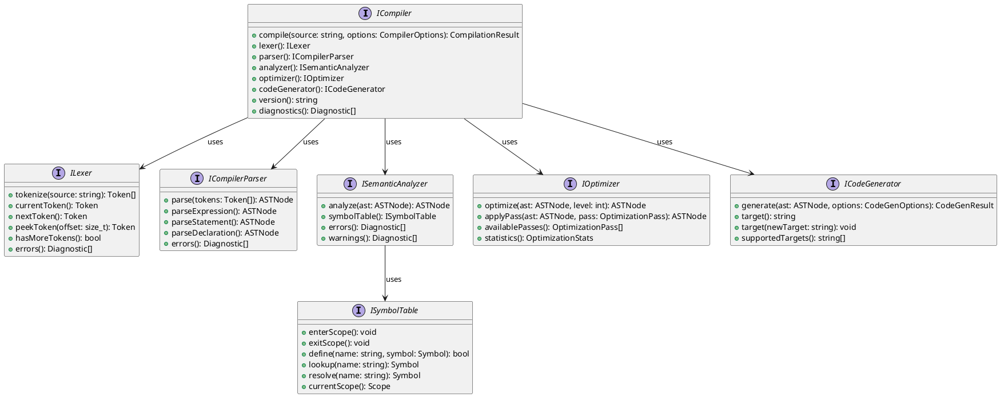
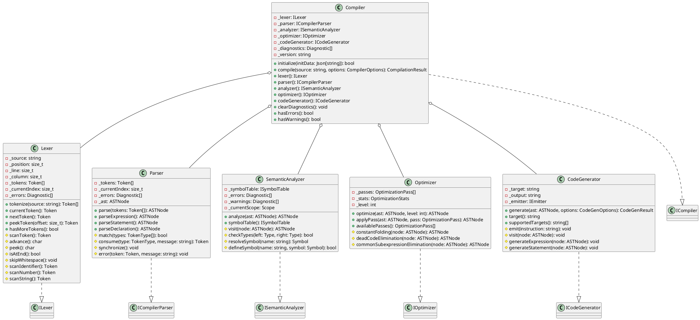
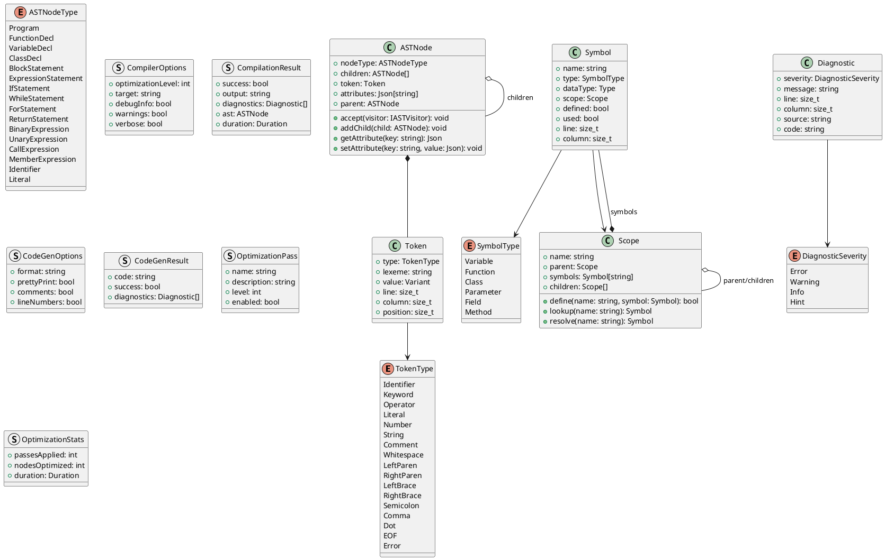
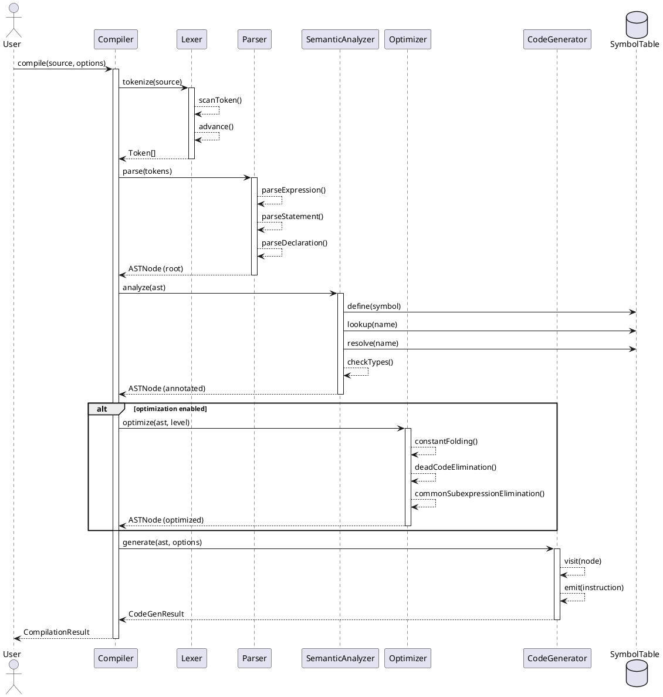
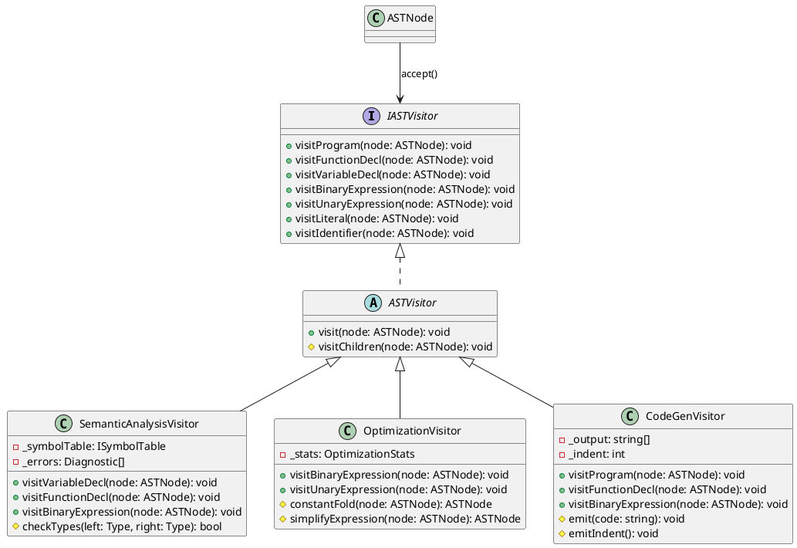
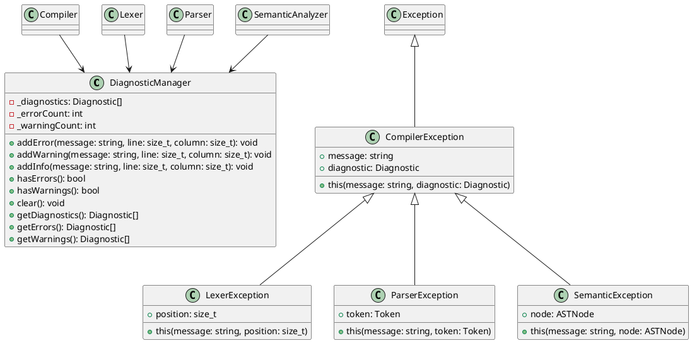
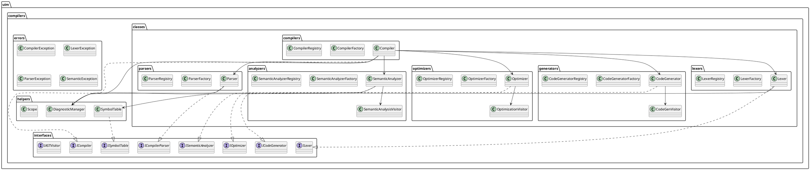

/****************************************************************************************************************
* Copyright: © 2018-2026 Ozan Nurettin Süel (aka UIManufaktur) 
* License: Subject to the terms of the Apache 2.0 license, as written in the included LICENSE.txt file. 
* Authors: Ozan Nurettin Süel (aka UIManufaktur)
*****************************************************************************************************************/

# UIM-Compiler UML Description

## Overview
The UIM-Compiler framework provides a modular compiler architecture with clear separation of concerns across the compilation pipeline. It implements the classic compiler design with lexical analysis, syntax analysis, semantic analysis, optimization, and code generation phases.

## Architecture Layers

### 1. Interface Layer (uim.compilers.interfaces)
Defines contracts for all compiler components:



### 2. Implementation Layer (uim.compilers.classes)



### 3. Data Structures



### 4. Compilation Pipeline



### 5. Visitor Pattern for AST Traversal



### 6. Factory and Registry Pattern for Component Creation and Lookup

```plantuml
@startuml Compiler_Factories_Registries

class LexerFactory {
  + register(key: string, creator: function): void
  + create(key: string, ...args): ILexer
}

class LexerRegistry {
  - _items: ILexer[string]
  + register(key: string, lexer: ILexer): void
  + get(key: string): ILexer
  + has(key: string): bool
  + unregister(key: string): void
}

class ParserFactory {
  + register(key: string, creator: function): void
  + create(key: string, ...args): ICompilerParser
}

class ParserRegistry {
  - _items: ICompilerParser[string]
  + register(key: string, parser: ICompilerParser): void
  + get(key: string): ICompilerParser
  + has(key: string): bool
  + unregister(key: string): void
}

class SemanticAnalyzerFactory {
  + register(key: string, creator: function): void
  + create(key: string, ...args): ISemanticAnalyzer
}

class SemanticAnalyzerRegistry {
  - _items: ISemanticAnalyzer[string]
  + register(key: string, analyzer: ISemanticAnalyzer): void
  + get(key: string): ISemanticAnalyzer
  + has(key: string): bool
  + unregister(key: string): void
}

class OptimizerFactory {
  + register(key: string, creator: function): void
  + create(key: string, ...args): IOptimizer
}

class OptimizerRegistry {
  - _items: IOptimizer[string]
  + register(key: string, optimizer: IOptimizer): void
  + get(key: string): IOptimizer
  + has(key: string): bool
  + unregister(key: string): void
}

class CodeGeneratorFactory {
  + register(key: string, creator: function): void
  + create(key: string, ...args): ICodeGenerator
}

class CodeGeneratorRegistry {
  - _items: ICodeGenerator[string]
  + register(key: string, codegen: ICodeGenerator): void
  + get(key: string): ICodeGenerator
  + has(key: string): bool
  + unregister(key: string): void
}

class CompilerFactory {
  + register(key: string, creator: function): void
  + create(key: string, ...args): ICompiler
}

class CompilerRegistry {
  - _items: ICompiler[string]
  + register(key: string, compiler: ICompiler): void
  + get(key: string): ICompiler
  + has(key: string): bool
  + unregister(key: string): void
}

LexerFactory ..> ILexer : creates
LexerRegistry o-- ILexer : stores
ParserFactory ..> ICompilerParser : creates
ParserRegistry o-- ICompilerParser : stores
SemanticAnalyzerFactory ..> ISemanticAnalyzer : creates
SemanticAnalyzerRegistry o-- ISemanticAnalyzer : stores
OptimizerFactory ..> IOptimizer : creates
OptimizerRegistry o-- IOptimizer : stores
CodeGeneratorFactory ..> ICodeGenerator : creates
CodeGeneratorRegistry o-- ICodeGenerator : stores
CompilerFactory ..> ICompiler : creates
CompilerRegistry o-- ICompiler : stores

@enduml
```



### 7. Error Handling



### 8. Complete System Overview



## Component Descriptions

### ICompiler / Compiler
**Purpose**: Orchestrates the entire compilation process
**Responsibilities**:
- Coordinate all compilation phases
- Manage compiler components (lexer, parser, analyzer, optimizer, code generator)
- Collect and report diagnostics
- Provide compilation results

### ILexer / Lexer
**Purpose**: Perform lexical analysis (tokenization)
**Responsibilities**:
- Break source code into tokens
- Track line and column numbers
- Handle whitespace and comments
- Report lexical errors

### ICompilerParser / Parser
**Purpose**: Perform syntax analysis
**Responsibilities**:
- Build Abstract Syntax Tree (AST) from tokens
- Validate syntactic structure
- Report syntax errors
- Handle error recovery

### ISemanticAnalyzer / SemanticAnalyzer
**Purpose**: Perform semantic analysis
**Responsibilities**:
- Type checking
- Symbol resolution
- Scope management
- Semantic validation
- Report semantic errors and warnings

### IOptimizer / Optimizer
**Purpose**: Optimize code representation
**Responsibilities**:
- Apply optimization passes
- Constant folding
- Dead code elimination
- Common subexpression elimination
- Track optimization statistics

### ICodeGenerator / CodeGenerator
**Purpose**: Generate target code
**Responsibilities**:
- Traverse optimized AST
- Emit target code
- Support multiple target formats
- Apply code generation options

### ISymbolTable / SymbolTable
**Purpose**: Manage symbols and scopes
**Responsibilities**:
- Track symbol definitions
- Resolve symbol references
- Manage scope hierarchy
- Support nested scopes

## Design Patterns Used

1. **Strategy Pattern**: Different algorithms for optimization passes
2. **Factory Pattern**: Component creation and configuration via dedicated factory classes
3. **Registry Pattern**: Runtime lookup and retrieval of registered component instances
4. **Visitor Pattern**: AST traversal and transformation
5. **Chain of Responsibility**: Error recovery and diagnostic reporting
6. **Composite Pattern**: AST node structure
7. **Template Method**: Base compilation pipeline with customizable steps

## Key Features

- **Modular Architecture**: Each compiler phase is independently replaceable
- **Pluggable Components**: Factory and registry patterns enable dynamic composition
- **Extensible**: New optimizations, code generators, and language features can be added
- **Error Recovery**: Robust error handling with detailed diagnostics
- **Multi-target**: Support for multiple output formats
- **Performance Tracking**: Built-in profiling and statistics
- **Type Safety**: Strong typing throughout the compilation pipeline
- **Runtime Configuration**: Use registries to select implementations at runtime

## Usage Examples

```d
// Basic compilation
auto compiler = new Compiler();
auto result = compiler.compile(sourceCode);

// Using registries for runtime configuration
auto lexerRegistry = new LexerRegistry();
lexerRegistry.register("json", new JsonLexer());
lexerRegistry.register("xml", new XmlLexer());

auto parserRegistry = new ParserRegistry();
parserRegistry.register("json", new JsonParser());
parserRegistry.register("xml", new XmlParser());

// Select implementation at runtime
auto format = "json"; // Could come from config
auto compiler = new Compiler();
compiler.lexer(lexerRegistry.get(format));
compiler.parser(parserRegistry.get(format));
auto result = compiler.compile(sourceCode);

// Custom configuration with factory
auto compiler = new Compiler();
compiler.lexer(new CustomLexer());
compiler.optimizer(new AggressiveOptimizer());
auto result = compiler.compile(sourceCode, 
  CompilerOptions(optimizationLevel: 3, target: "llvm-ir"));

// Use compiler registry for complete instances
auto compilerRegistry = new CompilerRegistry();
compilerRegistry.register("javascript", new JavaScriptCompiler());
compilerRegistry.register("typescript", new TypeScriptCompiler());

auto compiler = compilerRegistry.get("javascript");
auto result = compiler.compile(jsCode);
```

This UML description provides a comprehensive view of the uim-compiler framework architecture,
showing the relationships between components, data flow, and design patterns employed.
