/****************************************************************************************************************
* Copyright: © 2018-2026 Ozan Nurettin Süel (aka UIManufaktur) 
* License: Subject to the terms of the Apache 2.0 license, as written in the included LICENSE.txt file. 
* Authors: Ozan Nurettin Süel (aka UIManufaktur)
*****************************************************************************************************************/

# UIM-Events UML Description

## Overview
The UIM-Events framework provides a robust event-driven architecture implementing the Observer pattern. It enables decoupled communication between components through an event dispatcher system with support for synchronous/asynchronous dispatching, priority-based listener execution, one-time listeners, and annotation-based event handling.

## Architecture Layers

### 1. Core Interfaces (uim.events.interfaces)

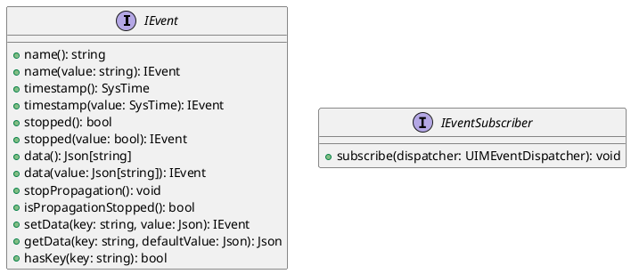

### 2. Core Classes

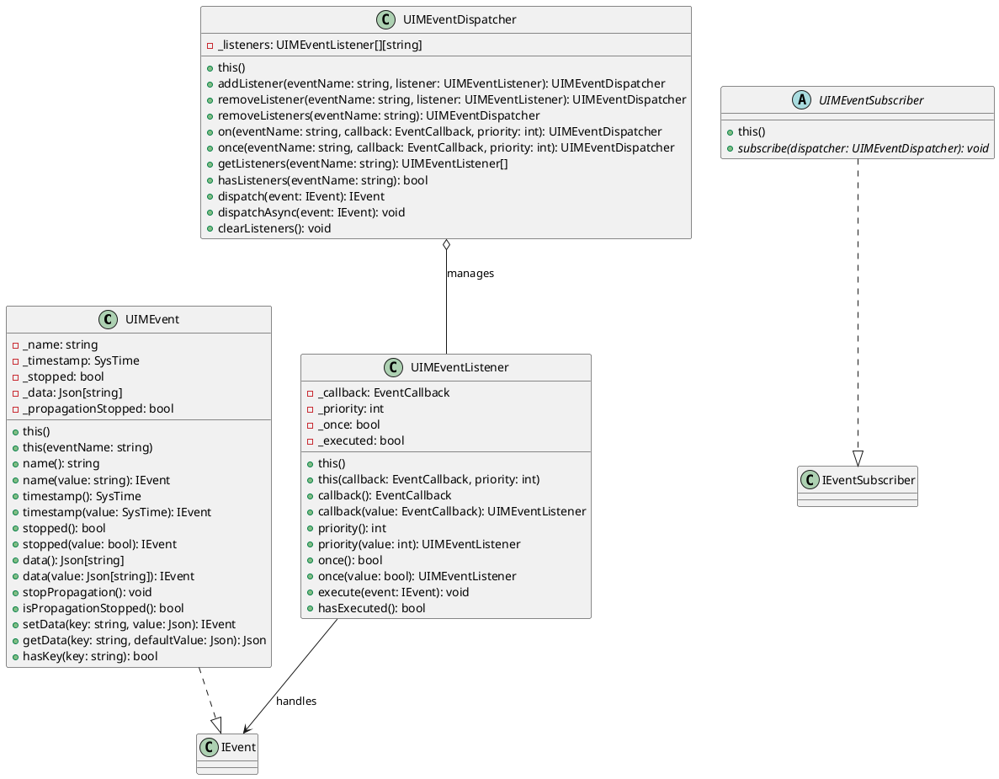

### 3. Annotation-Based Event Handling

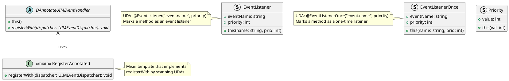

### 4. Event Lifecycle and Flow

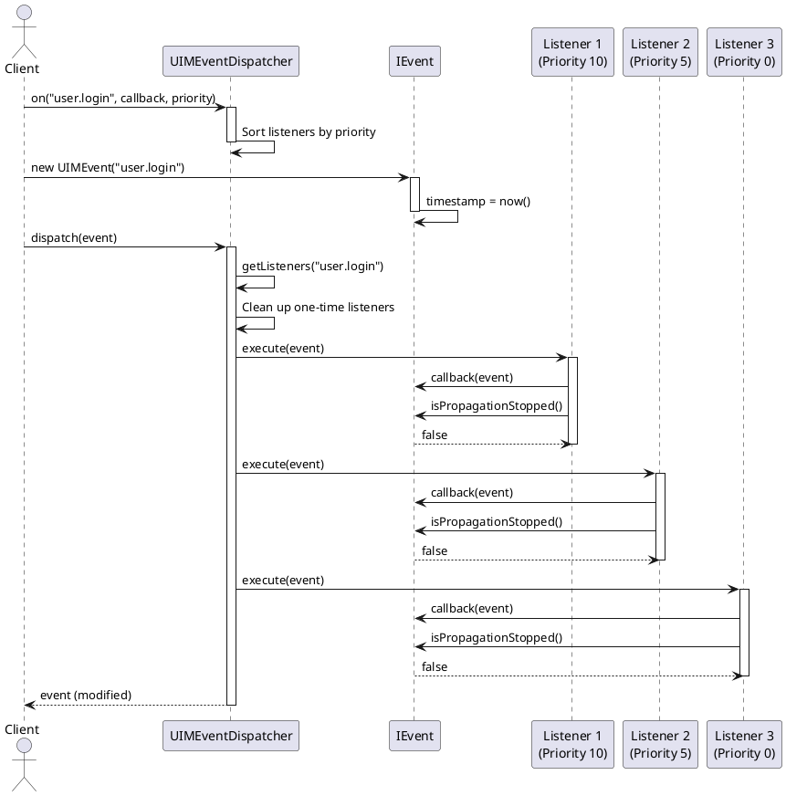

### 5. Priority-Based Execution

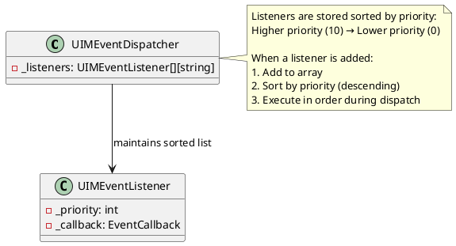

### 6. Propagation Control

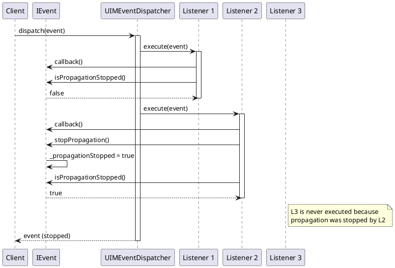

### 7. One-Time Listeners

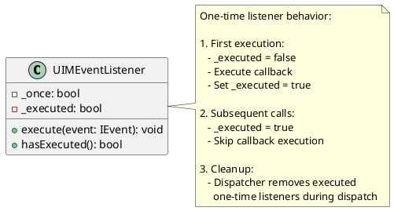

### 8. Synchronous vs Asynchronous Dispatch

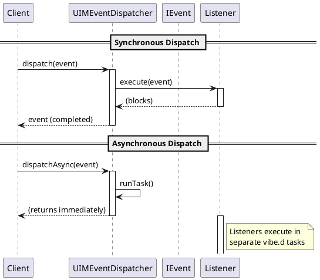

### 9. Annotated Event Handler Registration

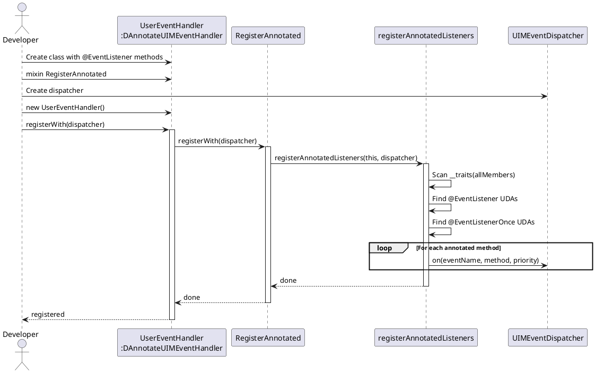

### 10. Complete System Architecture

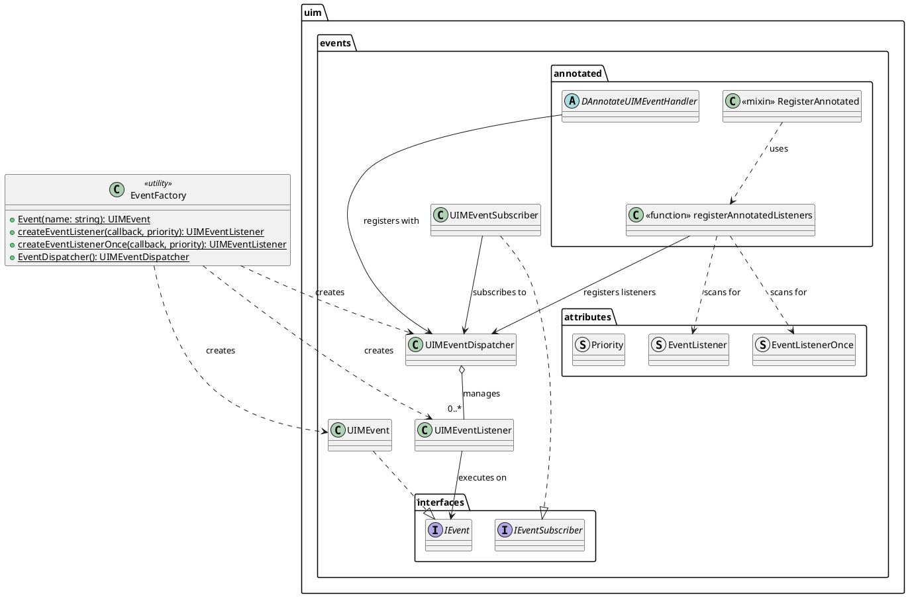

### 11. Event Data Management

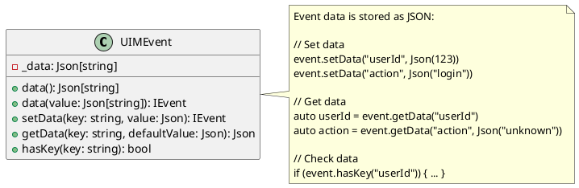

### 12. Class Hierarchy

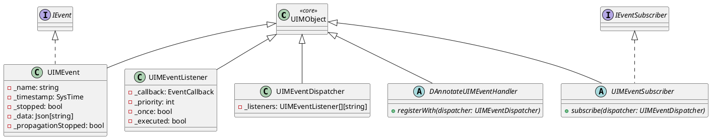

## Design Patterns

### 1. Observer Pattern
The core pattern implemented by the framework:
- **Subject**: `UIMEventDispatcher`
- **Observer**: `UIMEventListener`
- **Event**: `UIMEvent`
- Decouples event sources from event handlers

### 2. Strategy Pattern
Different listening strategies:
- Regular listeners (can be called multiple times)
- One-time listeners (execute only once)
- Priority-based execution order

### 3. Decorator Pattern
Event listeners can be wrapped with:
- Priority information
- One-time execution flag
- Async execution wrapper

### 4. Template Method Pattern
`UIMEventSubscriber` and `DAnnotateUIMEventHandler` define the skeleton:
- Base class provides registration mechanism
- Subclasses implement specific event subscriptions

## Key Features

### 1. Priority-Based Execution
Listeners execute in priority order (highest to lowest):
```d
dispatcher.on("event", callback1, priority: 10);  // Executes first
dispatcher.on("event", callback2, priority: 5);   // Executes second
dispatcher.on("event", callback3, priority: 0);   // Executes last
```

### 2. Propagation Control
Events can stop propagation to remaining listeners:
```d
void listener(IEvent event) {
    // Do something
    event.stopPropagation();  // No more listeners will execute
}
```

### 3. One-Time Listeners
Listeners that execute only once then auto-remove:
```d
dispatcher.once("app.init", (event) {
    // Initialization code - runs only once
});
```

### 4. Annotation-Based Registration
Use UDAs to declaratively register event handlers:
```d
class MyHandler : DAnnotateUIMEventHandler {
    mixin RegisterAnnotated;
    
    @EventListener("user.login", 10)
    void onUserLogin(IEvent event) {
        // Handle login
    }
    
    @EventListenerOnce("app.startup")
    void onStartup(IEvent event) {
        // One-time startup logic
    }
}
```

### 5. Asynchronous Dispatching
Non-blocking event dispatch using vibe.d:
```d
dispatcher.dispatchAsync(event);  // Returns immediately
```

### 6. Event Data Management
Events carry arbitrary JSON data:
```d
auto event = Event("user.action");
event.setData("userId", Json(123));
event.setData("action", Json("purchase"));

// In listener
auto userId = event.getData("userId").get!int;
```

## Type Definitions

```d
// Callback type for event listeners
alias EventCallback = void delegate(IEvent event) @safe;
```

## Usage Examples

### Basic Usage
```d
// Create dispatcher
auto dispatcher = EventDispatcher();

// Add listener
dispatcher.on("user.login", (IEvent event) {
    writeln("User logged in!");
});

// Dispatch event
auto event = Event("user.login");
event.setData("userId", Json(42));
dispatcher.dispatch(event);
```

### Priority-Based Listeners
```d
dispatcher.on("order.placed", (event) {
    writeln("Validate order");
}, 10);

dispatcher.on("order.placed", (event) {
    writeln("Process payment");
}, 5);

dispatcher.on("order.placed", (event) {
    writeln("Send confirmation");
}, 0);
```

### Event Subscribers
```d
class OrderEventSubscriber : UIMEventSubscriber {
    override void subscribe(UIMEventDispatcher dispatcher) {
        dispatcher.on("order.created", &onOrderCreated);
        dispatcher.on("order.shipped", &onOrderShipped);
        dispatcher.on("order.delivered", &onOrderDelivered);
    }
    
    void onOrderCreated(IEvent event) { /* ... */ }
    void onOrderShipped(IEvent event) { /* ... */ }
    void onOrderDelivered(IEvent event) { /* ... */ }
}

auto subscriber = new OrderEventSubscriber();
subscriber.subscribe(dispatcher);
```

### Annotated Handlers
```d
class UserEventHandler : DAnnotateUIMEventHandler {
    mixin RegisterAnnotated;
    
    @EventListener("user.registered", 10)
    void sendWelcomeEmail(IEvent event) {
        auto email = event.getData("email").get!string;
        // Send email
    }
    
    @EventListener("user.registered", 5)
    void createProfile(IEvent event) {
        // Create user profile
    }
    
    @EventListenerOnce("app.initialized")
    void onAppInit(IEvent event) {
        // One-time initialization
    }
}

auto handler = new UserEventHandler();
handler.registerWith(dispatcher);
```

### Propagation Control
```d
dispatcher.on("validation", (event) {
    if (!isValid(event.getData("data"))) {
        event.stopPropagation();  // Stop processing
    }
}, 10);

dispatcher.on("validation", (event) {
    // This won't execute if validation fails
    processData(event.getData("data"));
}, 0);
```

## Benefits

1. **Decoupling**: Components communicate without direct dependencies
2. **Extensibility**: New listeners can be added without modifying existing code
3. **Priority Control**: Fine-grained control over execution order
4. **Flexibility**: Multiple listening strategies (regular, one-time, annotated)
5. **Performance**: Async dispatching for non-blocking operations
6. **Type Safety**: Strong typing with D's type system
7. **Declarative**: UDA-based registration for cleaner code

## Best Practices

1. Use meaningful event names with namespacing: `"module.action"`
2. Set appropriate priorities for listeners that have dependencies
3. Use one-time listeners for initialization tasks
4. Leverage annotations for clean, declarative event handling
5. Include relevant data in events for context
6. Use propagation control for validation scenarios
7. Choose sync vs async dispatch based on requirements
8. Clean up listeners when they're no longer needed

This UML description provides a comprehensive view of the uim-events framework,
showing how components interact to provide a flexible, powerful event system.
