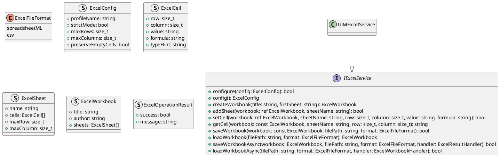
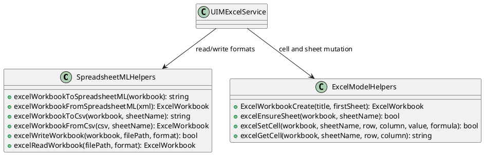
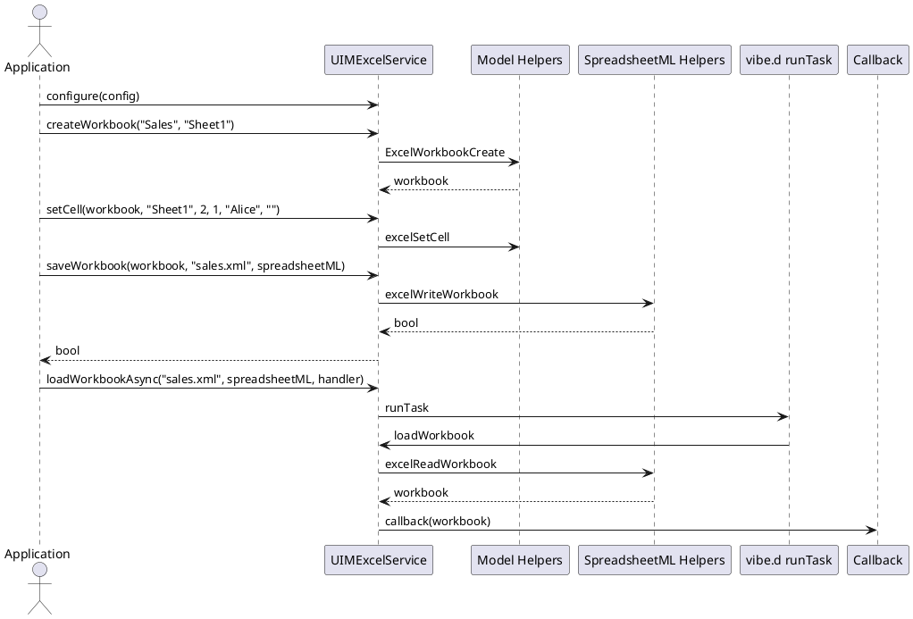

# UIM-EXCEL UML Description

## Overview

The UIM-EXCEL library provides typed workbook models and a vibe.d powered service layer to read and write Microsoft Excel compatible formats (SpreadsheetML and CSV).

## Core Types

## Helper Layer

## Sequence

