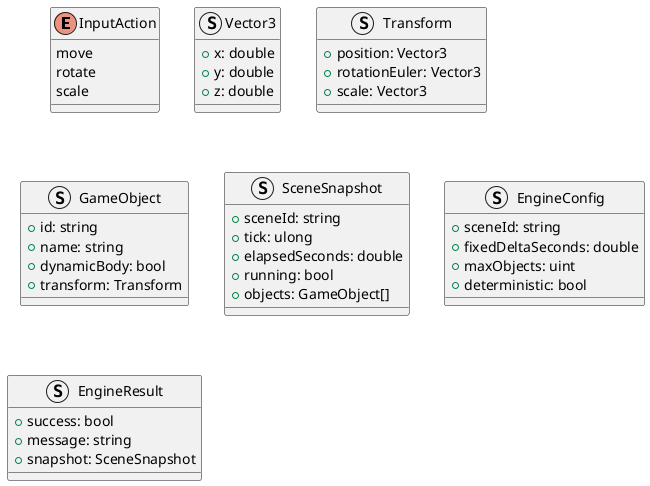
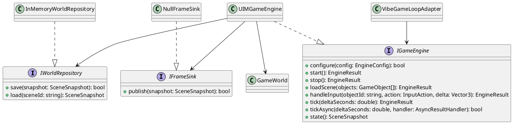
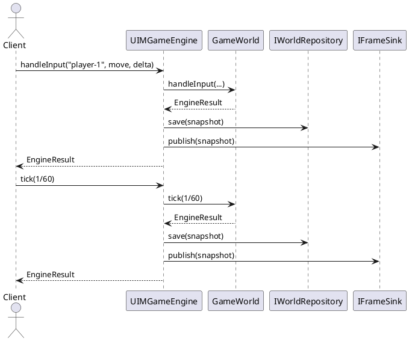
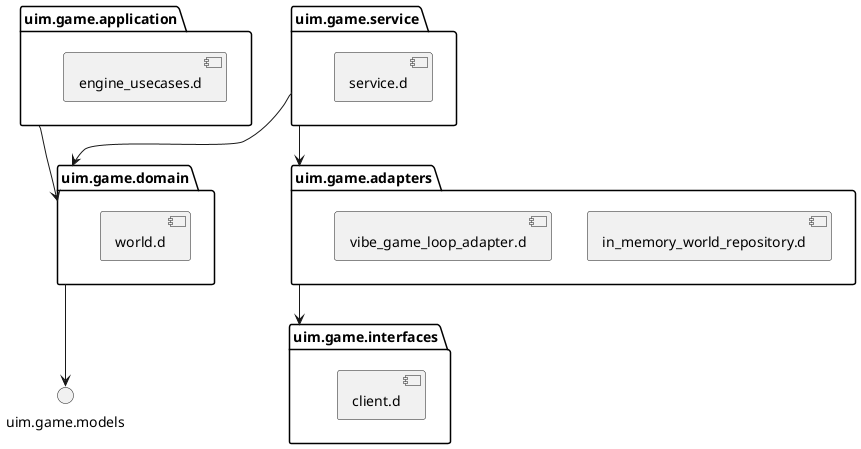

# UIM-GAME UML Description

## Overview

uim-game provides a clean + hexagonal architecture for a 3D web game engine built with D and vibe.d integration points.

## Core Model

## Hexagonal Ports

## Sequence: One Tick with Input

## Package Dependencies

