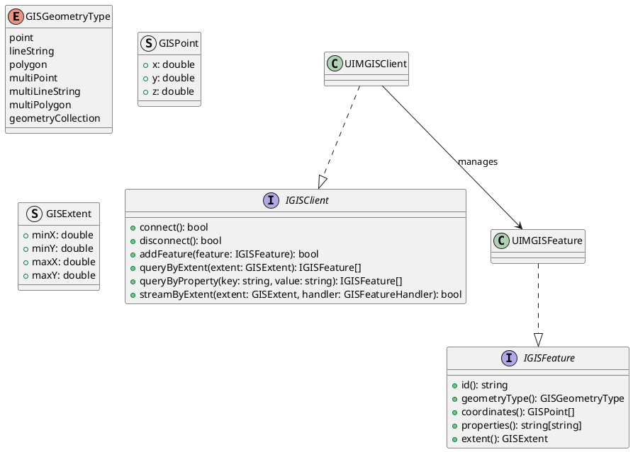
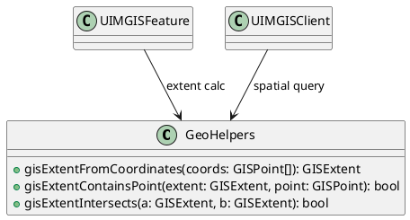
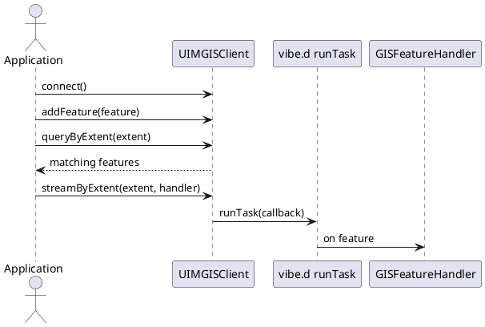

# UIM-GIS UML Description

## Overview

The UIM-GIS library provides a compact geospatial architecture for D applications using vibe.d runtime patterns. It includes feature modeling, extent-based querying, and asynchronous stream callbacks.

## Core Types

## Helper Layer

## Sequence

