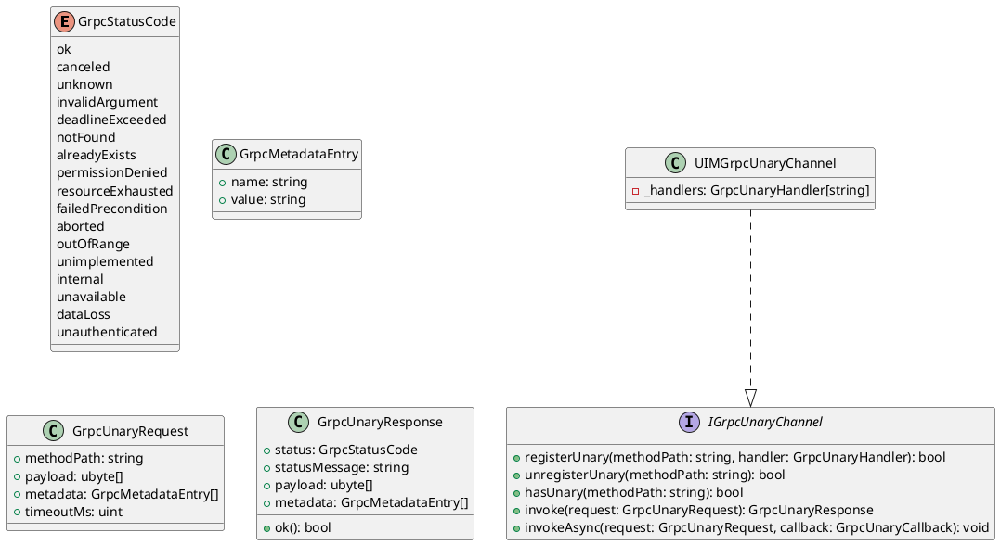
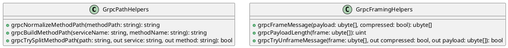
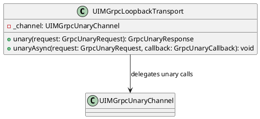
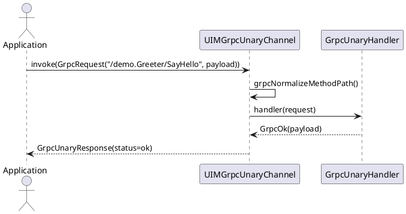

/****************************************************************************************************************
* Copyright: © 2018-2026 Ozan Nurettin Süel (aka UI-Manufaktur UG *R.I.P*)
* License: Subject to the terms of the Apache 2.0 license, as written in the included LICENSE.txt file.
* Authors: Ozan Nurettin Süel (aka UI-Manufaktur UG *R.I.P*)
*****************************************************************************************************************/

# UIM-gRPC UML Description

## Overview
The UIM-gRPC library provides a focused architecture for unary gRPC workflows in D. It includes typed request/response contracts, wire framing helpers, method path utilities, and an in-process channel with vibe.d task-based asynchronous dispatch.

## Core Contracts

## Helper Layer

## Transport Facade

## Unary Sequence

