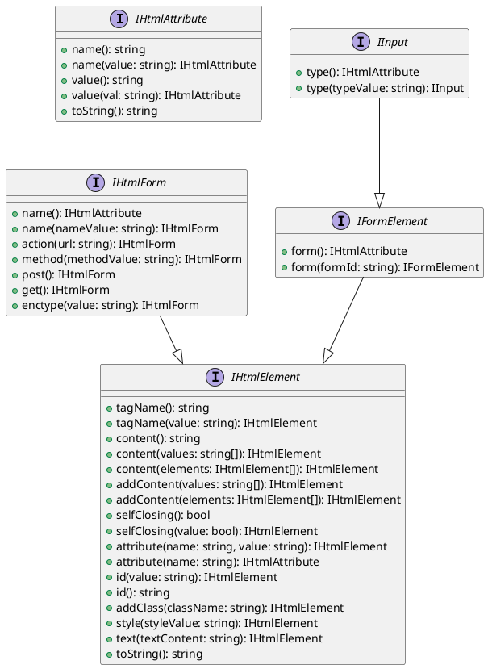
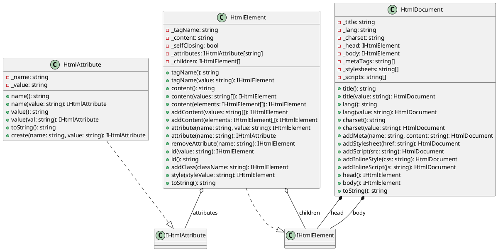
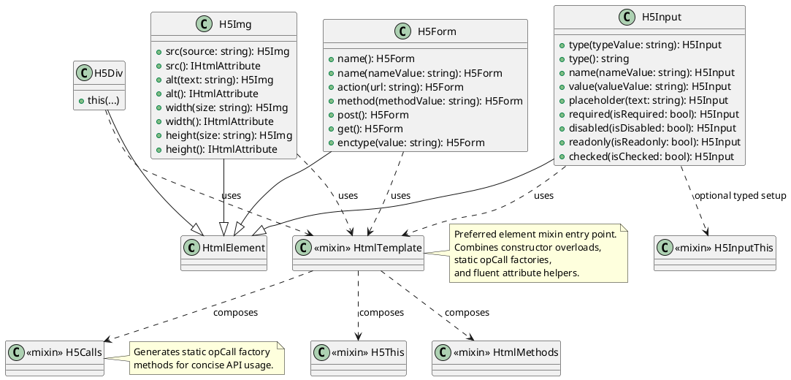
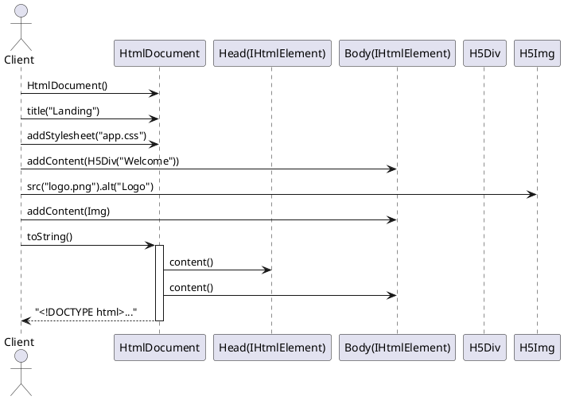

/****************************************************************************************************************
* Copyright: © 2018-2026 Ozan Nurettin Süel (aka UI-Manufaktur UG *R.I.P*) 
* License: Subject to the terms of the Apache 2.0 license, as written in the included LICENSE.txt file. 
* Authors: Ozan Nurettin Süel (aka UI-Manufaktur UG *R.I.P*)
*****************************************************************************************************************/

# UIM-HTML UML Description

## Overview
The UIM-HTML library provides a fluent, type-safe API for composing HTML documents and elements in D. The architecture is centered on a small set of interfaces and base classes (`IHtmlElement`, `HtmlElement`, `HtmlDocument`) that are specialized through mixins and concrete HTML5 element classes.

## Architecture Layers

### 1. Interface Layer (uim.html.interfaces)
Defines the contracts for attributes, generic elements, form elements, and input behavior.

### 2. Core Implementation Layer (uim.html.classes)
Provides the foundational classes used by all concrete HTML element implementations.

### 3. Element Specialization Layer (uim.html.classes.elements.*)
Concrete HTML tags are modeled as specialized classes inheriting `HtmlElement`.

### 4. UDA Metadata Layer (uim.html.udas)
The library exposes UDAs for compile-time metadata and reflection.

```plantuml
@startuml HTML_UDA_Layer

struct HtmlTag {
  + name: string
  + this(tagName: string)
}

struct VoidElement

struct HtmlCategory {
  + name: string
  + this(categoryName: string)
}

struct SupportsAttribute {
  + name: string
  + this(attributeName: string)
}

struct DeprecatedHtml {
  + reason: string
  + this(deprecationReason: string)
}

class "<<template>> hasHtmlTagAttribute" as hasHtmlTagAttribute
class "<<template>> getHtmlTagAttribute" as getHtmlTagAttribute
class "<<template>> hasVoidElementAttribute" as hasVoidElementAttribute
class "<<template>> hasHtmlCategoryAttribute" as hasHtmlCategoryAttribute
class "<<template>> getHtmlCategoryAttribute" as getHtmlCategoryAttribute
class "<<template>> hasSupportsAttributeAttribute" as hasSupportsAttributeAttribute
class "<<template>> getSupportsAttribute" as getSupportsAttribute
class "<<template>> getSupportsAttributes" as getSupportsAttributes
class "<<template>> hasDeprecatedHtmlAttribute" as hasDeprecatedHtmlAttribute
class "<<template>> getDeprecatedHtmlAttribute" as getDeprecatedHtmlAttribute

hasHtmlTagAttribute ..> HtmlTag
getHtmlTagAttribute ..> HtmlTag
hasVoidElementAttribute ..> VoidElement
hasHtmlCategoryAttribute ..> HtmlCategory
getHtmlCategoryAttribute ..> HtmlCategory
hasSupportsAttributeAttribute ..> SupportsAttribute
getSupportsAttribute ..> SupportsAttribute
getSupportsAttributes ..> SupportsAttribute
hasDeprecatedHtmlAttribute ..> DeprecatedHtml
getDeprecatedHtmlAttribute ..> DeprecatedHtml

@enduml
```

### 5. Document Rendering Sequence
Shows how a complete page is assembled and rendered to a final HTML string.

## Notes
- Most concrete elements are generated with `HtmlTemplate!(ElementType, Name, Tag, selfClosing)`, which composes `H5This`, `H5Calls`, and `HtmlMethods`.
- `HtmlDocument` owns page-level concerns (head/body/meta/resources), while `HtmlElement` focuses on tag-level composition and rendering.
- UDA support in `uim.html.udas` enables compile-time classification and metadata-driven tooling for elements.
