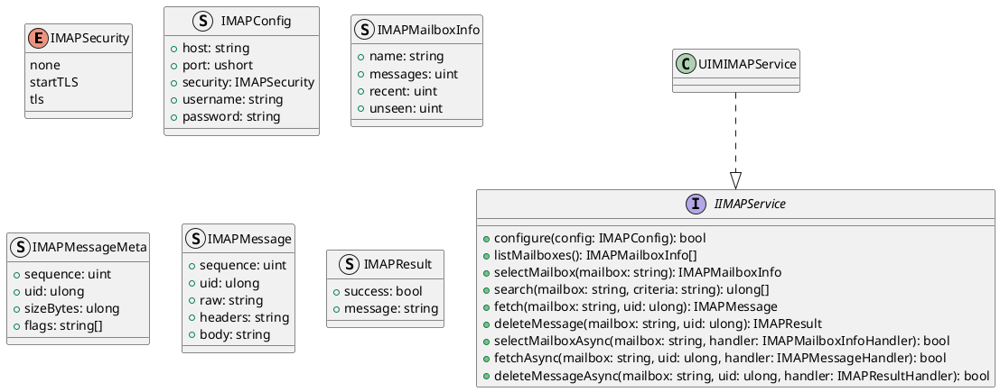
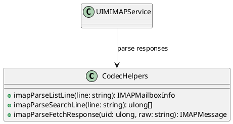
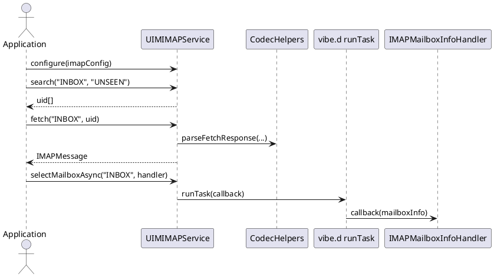

# UIM-IMAP UML Description

## Overview

The UIM-IMAP library provides a compact architecture for IMAP mailbox workflows in D. It combines typed contracts, parser helpers, model constructors, and service-level orchestration with asynchronous callback support using vibe.d.

## Core Types

## Helper Layer

## Sequence

