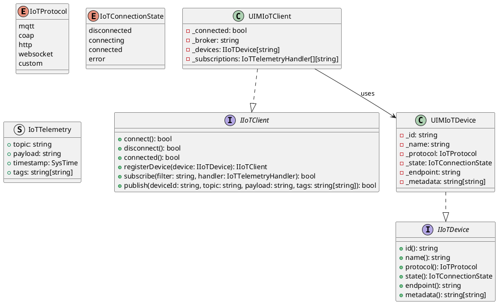
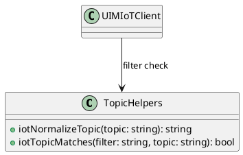
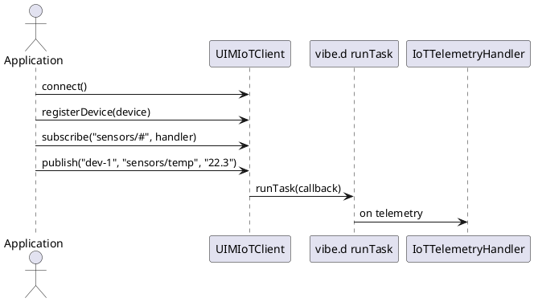

# UIM-IoT UML Description

## Overview

The UIM-IoT library provides a compact architecture for IoT-oriented applications in D using vibe.d runtime primitives. It includes a typed device model, topic helpers, and an asynchronous event dispatch client.

## Core Types

## Helper Layer

## Sequence

