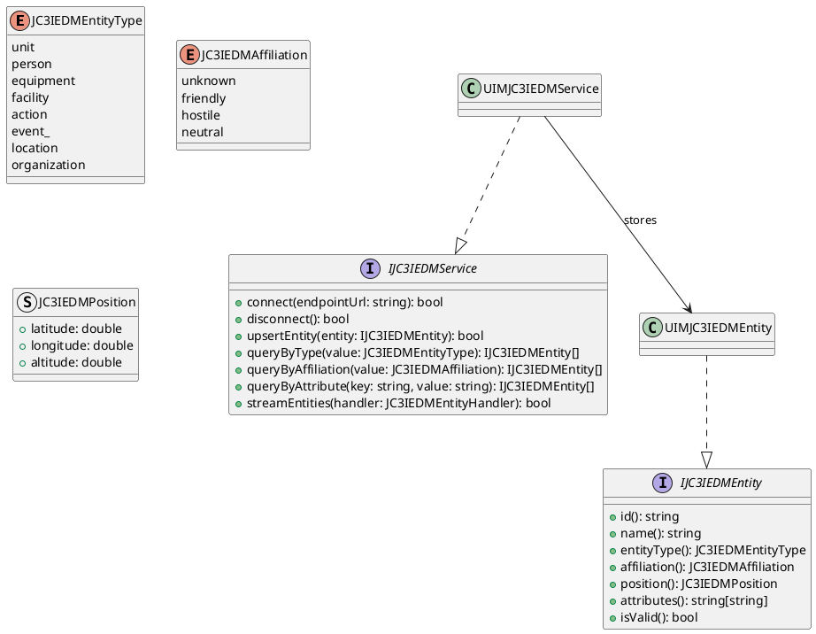
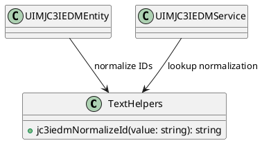
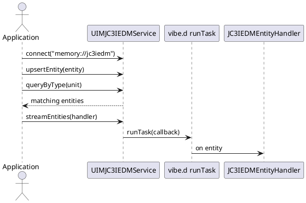

# UIM-JC3IEDM UML Description

## Overview

The UIM-JC3IEDM library models command-and-control information entities aligned with JC3IEDM concepts and provides a service API for query and asynchronous stream workflows.

## Core Types

## Helper Layer

## Sequence

