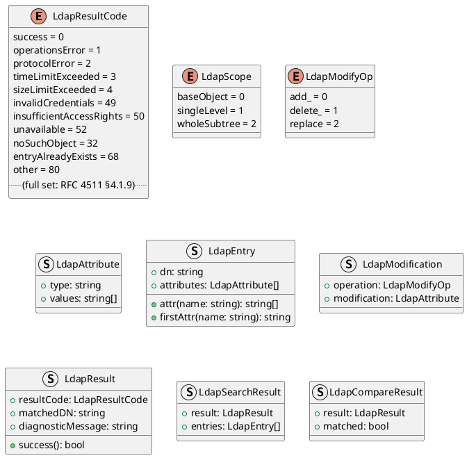
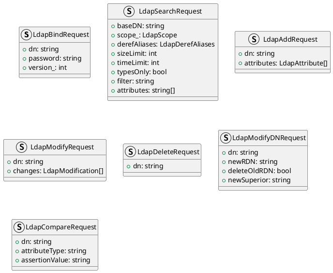
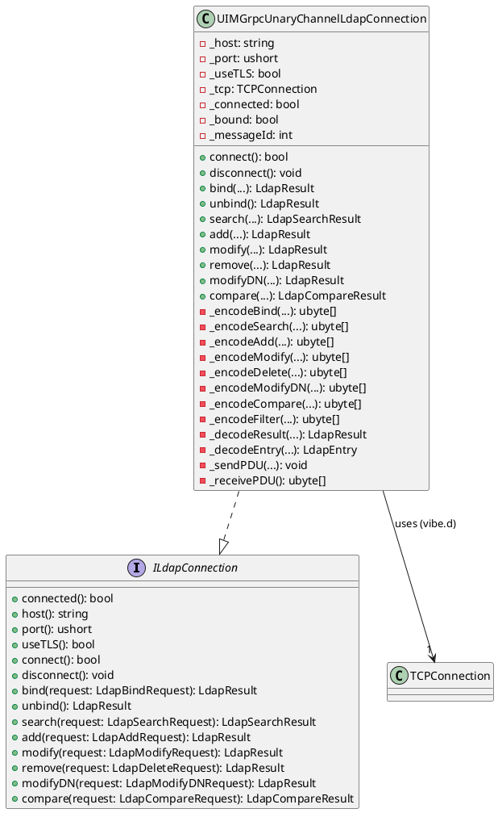
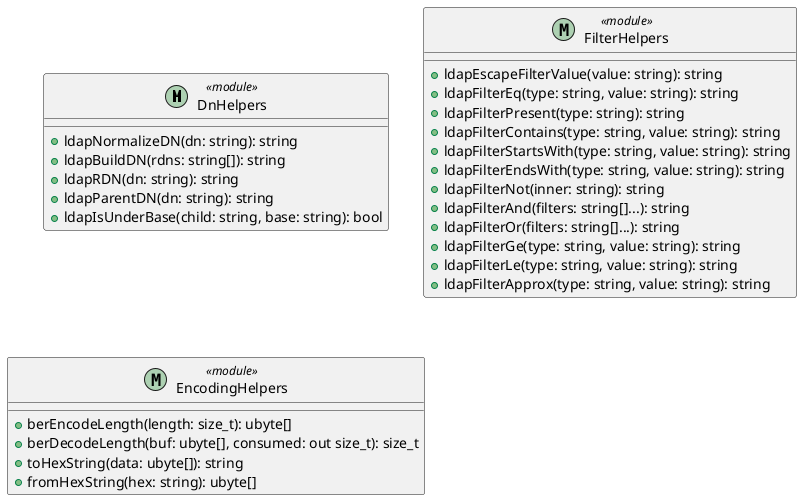
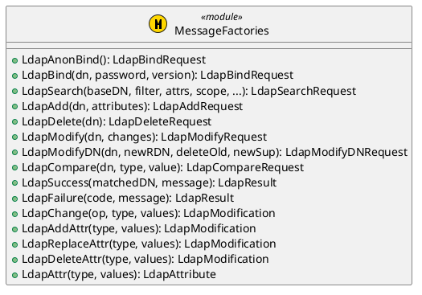
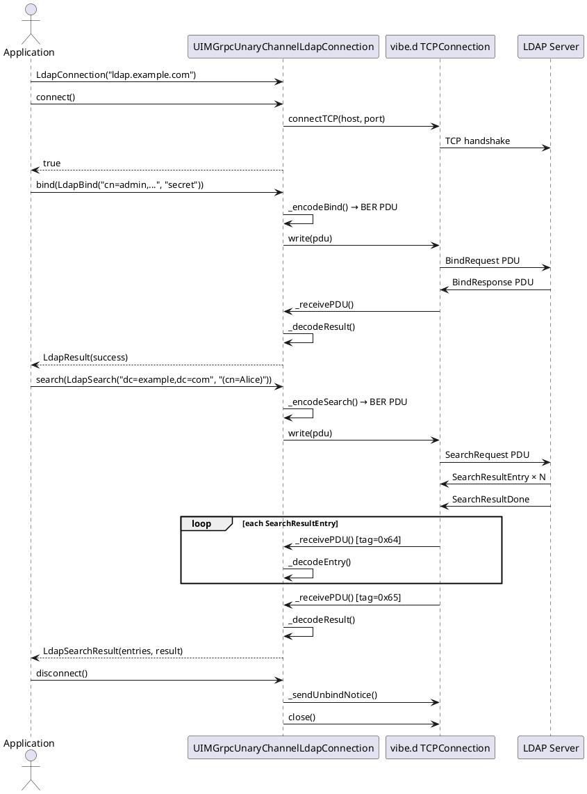

/****************************************************************************************************************
* Copyright: © 2018-2026 Ozan Nurettin Suel (aka UI-Manufaktur UG *R.I.P*)
* License: Subject to the terms of the Apache 2.0 license, as written in the included LICENSE.txt file.
* Authors: Ozan Nurettin Suel (aka UI-Manufaktur UG *R.I.P*)
*****************************************************************************************************************/

# UIM-LDAP UML Description

## Overview

The `uim-ldap` library is structured around a clean separation between protocol contracts (`interfaces`), utility helpers (`helpers`), factory functions (`message`), and the vibe.d TCP connection (`connection`). All LDAP operations are exposed through the `ILdapConnection` interface so that mock/test implementations can substitute the real TCP connection easily.

---

## Core Type Model

---

## Request Types

---

## Connection Interface and Implementation

---

## Helper Layer

---

## Message Factory Layer

---

## Sequence: Bind and Search

