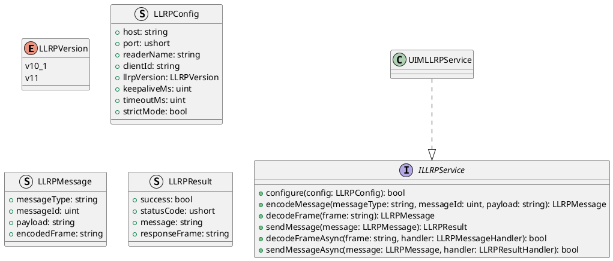
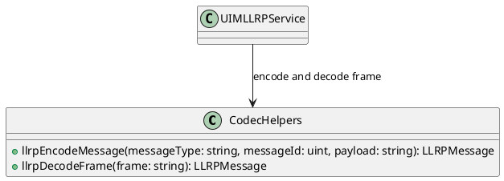
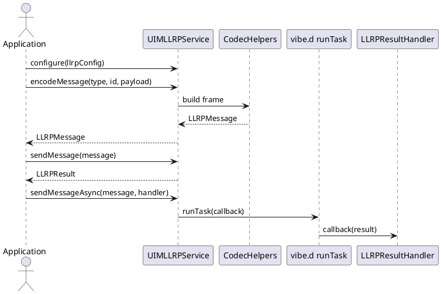

# UIM-LLRP UML Description

## Overview

The UIM-LLRP library provides a compact architecture for Low Level Reader Protocol workflows in D. It combines typed contracts, frame codec helpers, model constructors, and service-level orchestration with asynchronous callback support using vibe.d.

## Core Types

## Helper Layer

## Sequence

