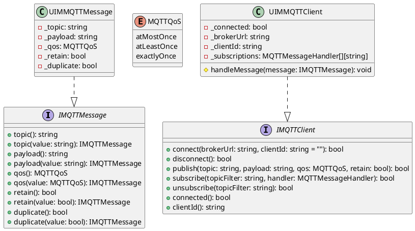
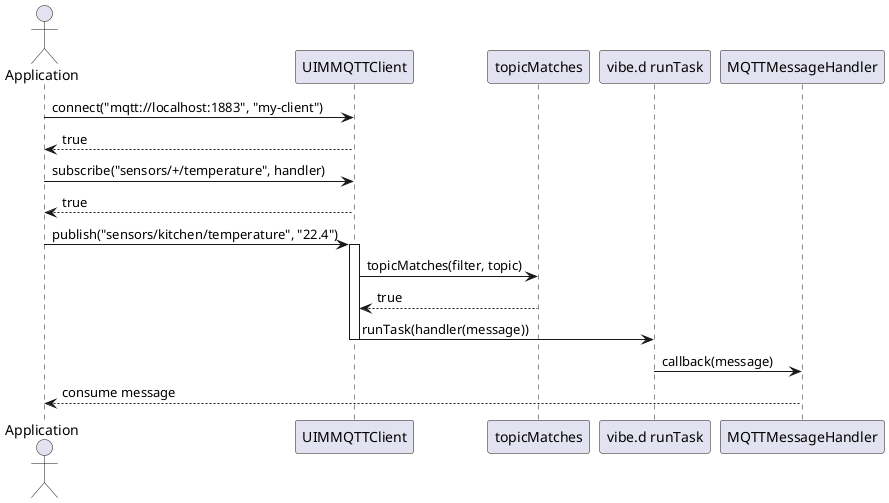
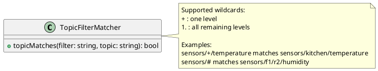

/****************************************************************************************************************
* Copyright: © 2018-2026 Ozan Nurettin Suel (aka UI-Manufaktur UG *R.I.P*)
* License: Subject to the terms of the Apache 2.0 license, as written in the included LICENSE.txt file.
* Authors: Ozan Nurettin Suel (aka UI-Manufaktur UG *R.I.P*)
*****************************************************************************************************************/

# UIM-MQTT UML Description

## Overview
The UIM-MQTT library provides a clean and asynchronous MQTT programming interface for D applications. It models messages and client behavior through interfaces and concrete implementations, and uses vibe.d tasks for asynchronous delivery.

## Core Types

## Message Delivery Flow

## Topic Matching Rules

