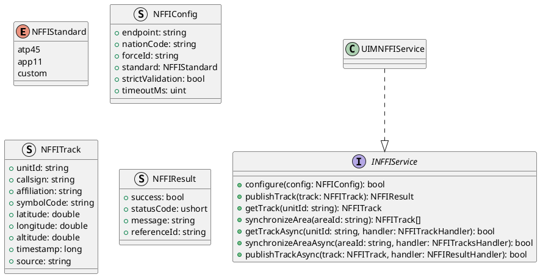
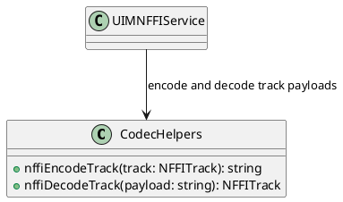
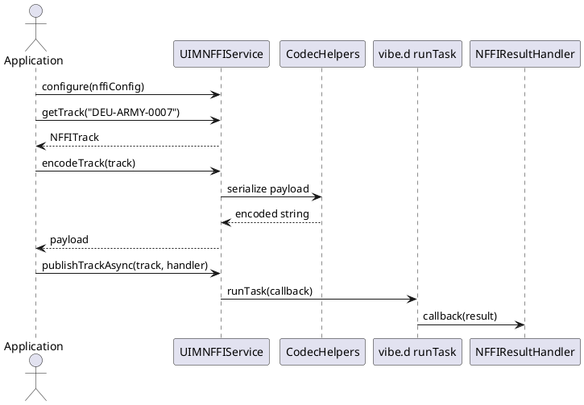

# UIM-NFFI UML Description

## Overview

The UIM-NFFI library provides a compact architecture for NATO Friendly Force Information workflows in D. It combines typed contracts, payload codec helpers, model constructors, and service-level orchestration with asynchronous callback support using vibe.d.

## Core Types

## Helper Layer

## Sequence

