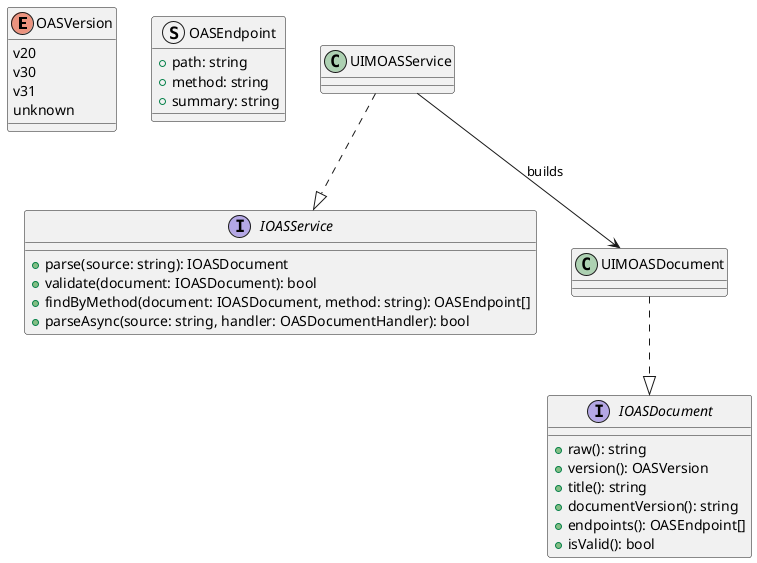
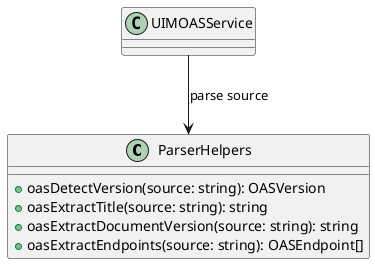
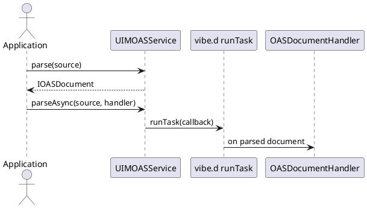

# UIM-OAS UML Description

## Overview

The UIM-OAS library provides a compact architecture for parsing and querying OpenAPI Specification content in D applications using vibe.d asynchronous patterns.

## Core Types

## Helper Layer

## Sequence

