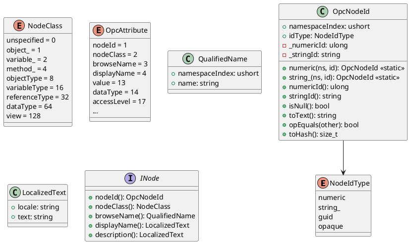
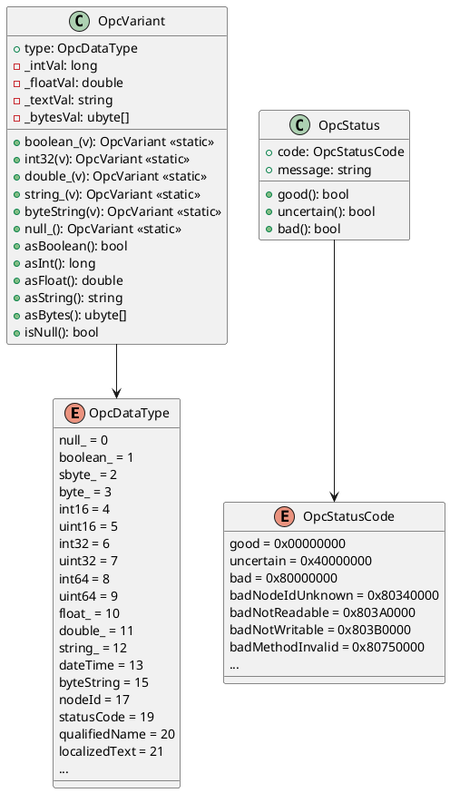
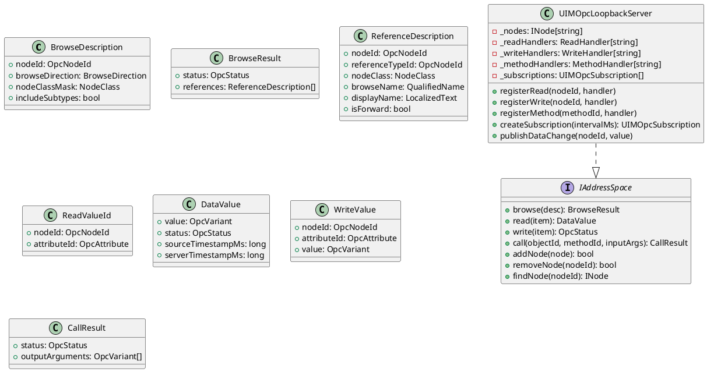
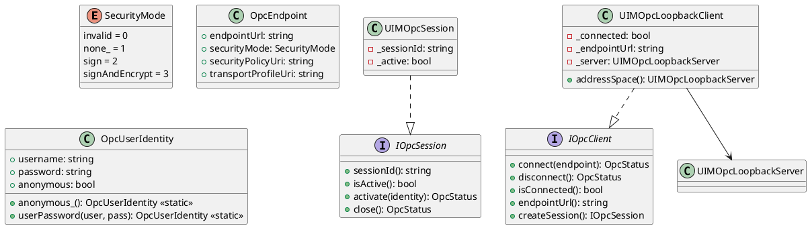
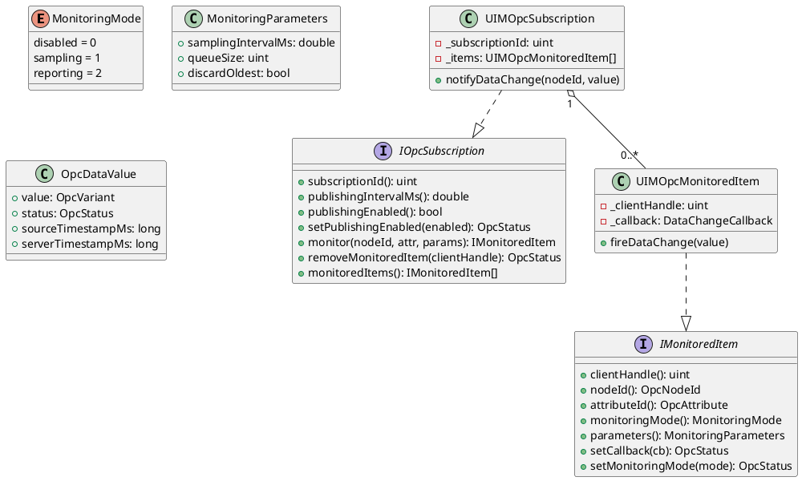
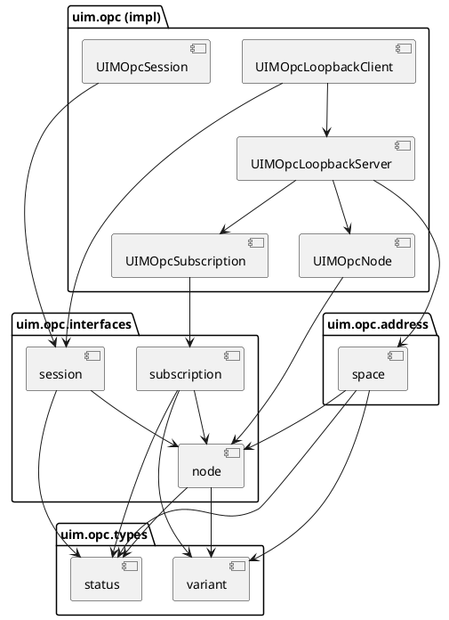

/****************************************************************************************************************
* Copyright: © 2018-2026 Ozan Nurettin Suel (aka UI-Manufaktur UG *R.I.P*)
* License: Subject to the terms of the Apache 2.0 license, as written in the included LICENSE.txt file.
* Authors: Ozan Nurettin Suel (aka UI-Manufaktur UG *R.I.P*)
*****************************************************************************************************************/

# UIM-OPC UML Description

## Overview

The UIM-OPC library provides a typed OPC UA address space model for D. It separates contracts (interfaces) from implementations, uses a tagged variant for typed values, and provides an in-process loopback server for testing without a live OPC UA server.

## Type System

## Variant and Status

## Address Space

## Session and Client

## Subscription Model

## Component Dependency Graph

