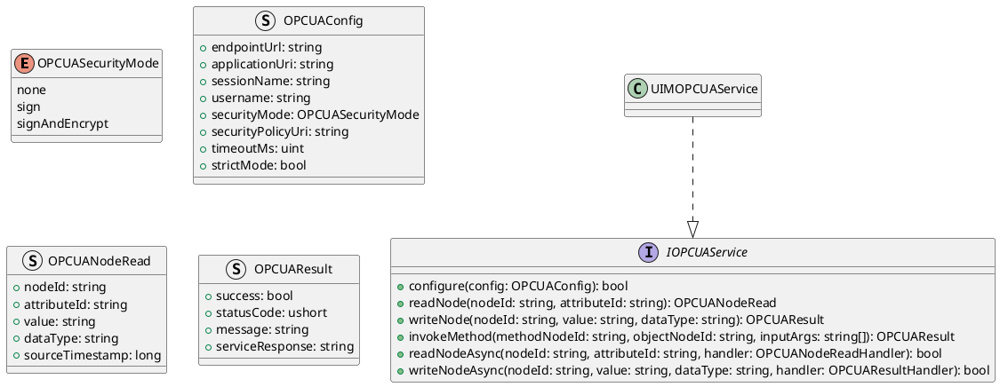
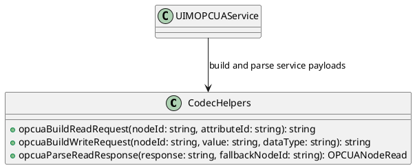
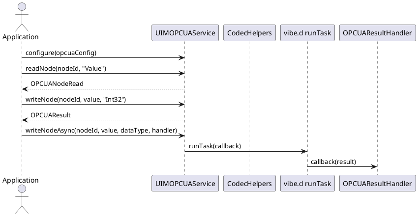

# UIM-OPCUA UML Description

## Overview

The UIM-OPCUA library provides a compact architecture for OPC UA workflows in D. It combines typed contracts, request/response helpers, model constructors, and service-level orchestration with asynchronous callback support using vibe.d.

## Core Types

## Helper Layer

## Sequence

