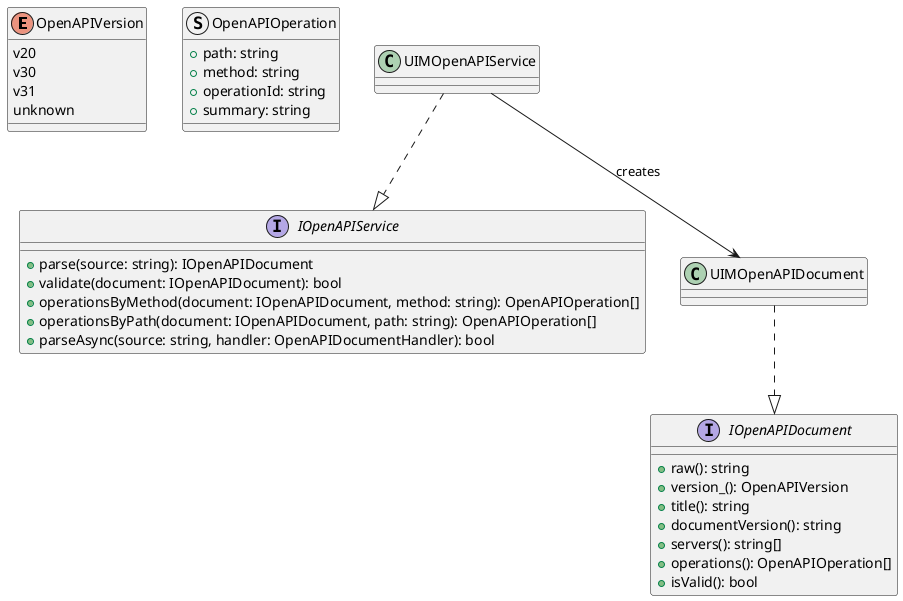
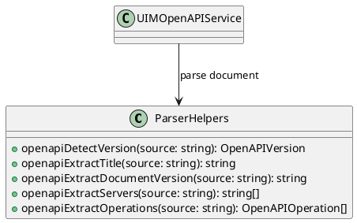
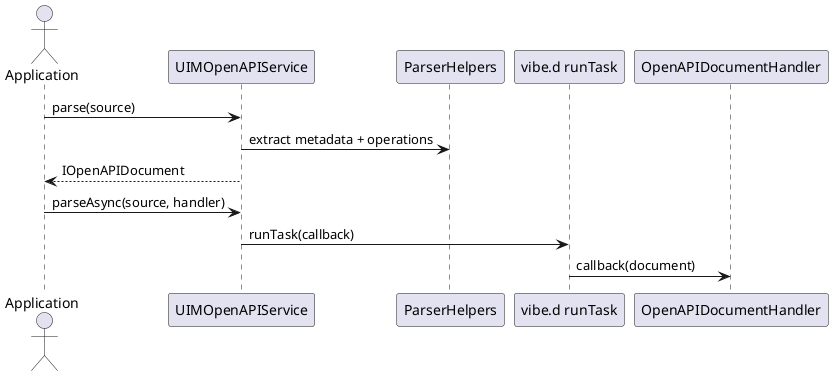

# UIM-OPENAPI UML Description

## Overview

The UIM-OPENAPI library provides a compact architecture to parse and query OpenAPI documents in D. It combines typed document models, lightweight parser helpers, and service-level orchestration with async callback support via vibe.d.

## Core Types

## Helper Layer

## Sequence

