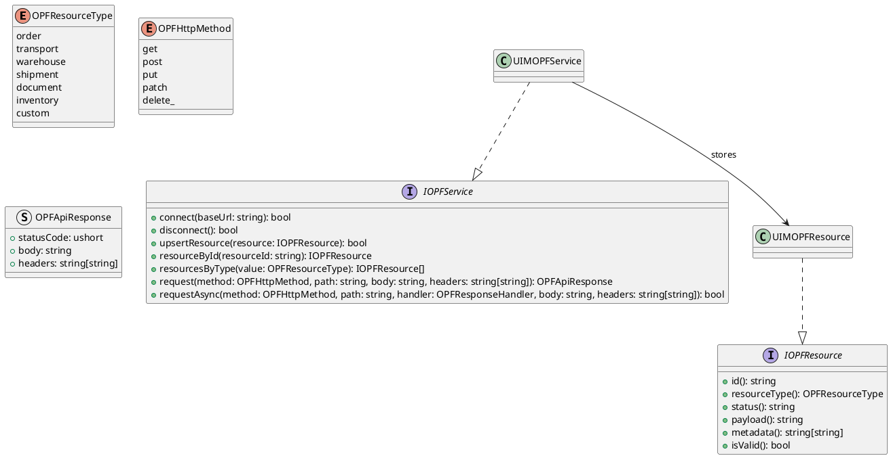
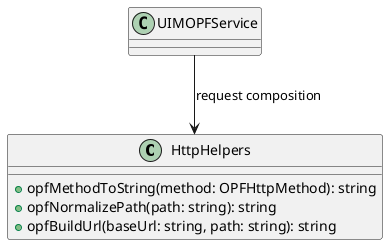
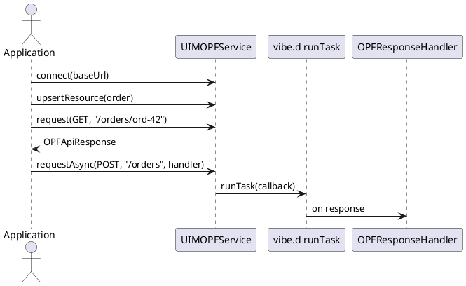

# UIM-OPF UML Description

## Overview

The UIM-OPF library provides a compact architecture for working with Open Logistics Foundation API domains in D. It combines typed logistics resources, API request abstractions, and asynchronous callback dispatch.

## Core Types

## Helper Layer

## Sequence

