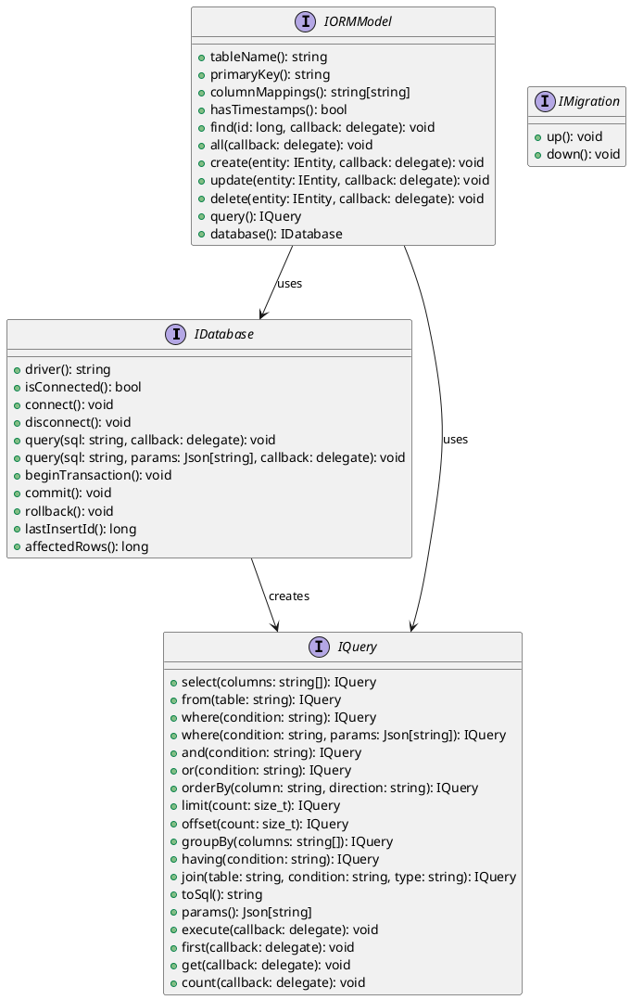
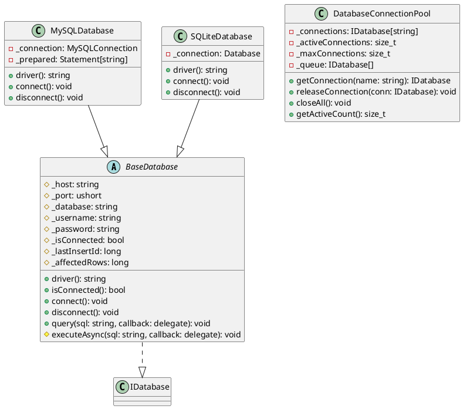
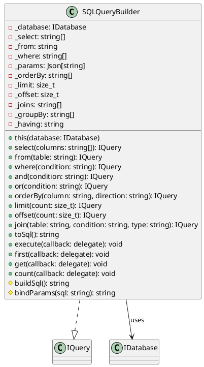
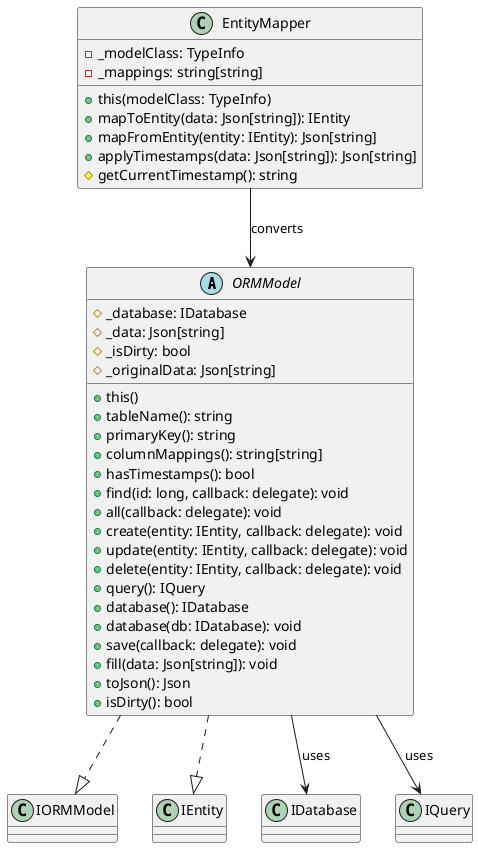
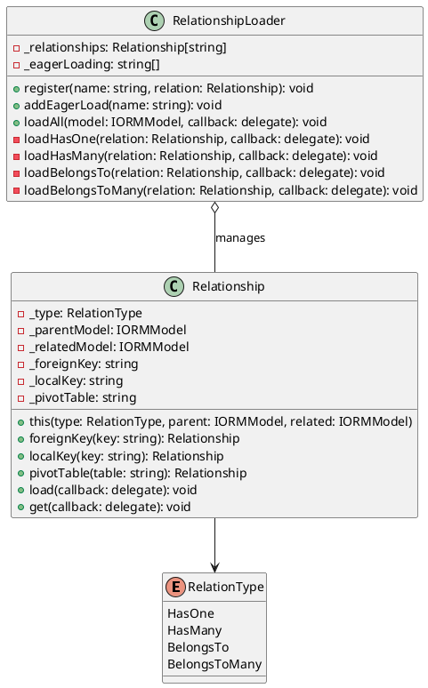
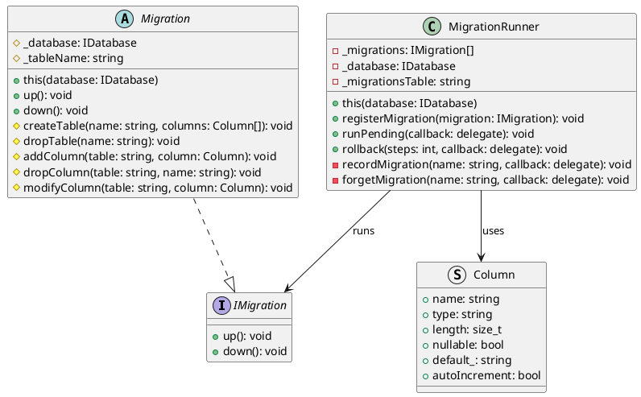
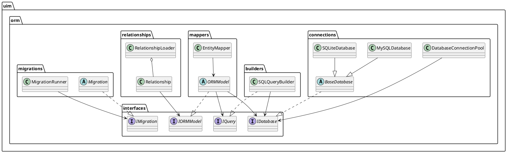
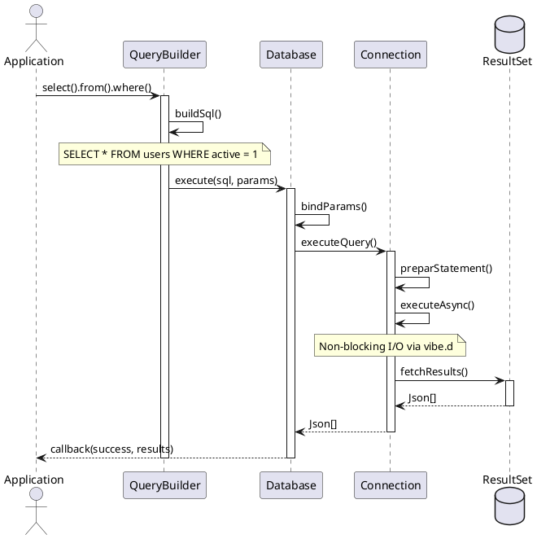
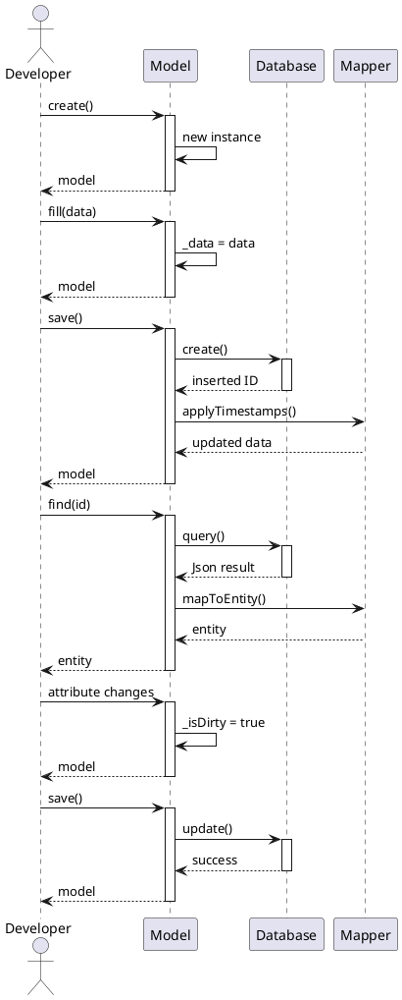

/****************************************************************************************************************
* Copyright: © 2018-2026 Ozan Nurettin Süel (aka UI-Manufaktur UG *R.I.P*) 
* License: Subject to the terms of the Apache 2.0 license, as written in the included LICENSE.txt file. 
* Authors: Ozan Nurettin Süel (aka UI-Manufaktur UG *R.I.P*)
*****************************************************************************************************************/

# UIM-ORM UML Description

## Overview
The UIM-ORM framework provides a comprehensive, type-safe Object-Relational Mapping solution for D language applications. It integrates seamlessly with vibe.d for asynchronous, non-blocking database operations and provides a fluent query builder, model mapping, relationship management, and migration support.

## Architecture Layers

### 1. Interface Layer (uim.orm.interfaces)
Defines contracts for all ORM components:



### 2. Implementation Layer (uim.orm.connections)



### 3. Query Builder Layer (uim.orm.builders)



### 4. Model Mapping Layer (uim.orm.mappers)



### 5. Relationships Layer (uim.orm.relationships)



### 6. Migrations Layer (uim.orm.migrations)



### 7. Complete System Overview



### 8. Data Flow: Query Execution Pipeline



### 9. Model Lifecycle



## Component Descriptions

### IDatabase / BaseDatabase
**Purpose**: Manage database connections and execute raw queries
**Responsibilities**:
- Maintain connection state (open/closed)
- Execute async queries with callbacks
- Handle transactions (begin, commit, rollback)
- Track inserted IDs and affected rows
- Support parameterized queries to prevent SQL injection

### IQuery / SQLQueryBuilder
**Purpose**: Build SQL queries with fluent interface
**Responsibilities**:
- Build SELECT, INSERT, UPDATE, DELETE queries
- Support WHERE, JOIN, ORDER BY, LIMIT, OFFSET, GROUP BY, HAVING
- Bind parameters safely
- Execute and return results asynchronously
- Track selected columns, tables, and conditions

### IORMModel / ORMModel
**Purpose**: Map objects to database rows
**Responsibilities**:
- Define table and column mappings
- Load and save entity data
- Track dirty state for updates
- Support timestamps (created_at, updated_at)
- Provide query builder interface

### EntityMapper
**Purpose**: Convert between entities and database rows
**Responsibilities**:
- Map database columns to entity properties
- Apply automatic timestamps
- Serialize entities to Json
- Deserialize Json to entities

### Relationship
**Purpose**: Define relationships between models
**Responsibilities**:
- Support HasOne, HasMany, BelongsTo, BelongsToMany relationships
- Configure foreign and local keys
- Load related models
- Support eager loading optimization

### RelationshipLoader
**Purpose**: Load relationships efficiently
**Responsibilities**:
- Manage relationship definitions
- Perform eager loading to reduce queries
- Execute relationship queries asynchronously

### IMigration / Migration / MigrationRunner
**Purpose**: Version-control database schema
**Responsibilities**:
- Define up/down migrations
- Track executed migrations
- Run pending migrations
- Rollback previous migrations
- Support table and column operations

## Design Patterns Used

1. **Repository Pattern**: Models act as repositories for their data
2. **Query Builder Pattern**: Fluent interface for SQL construction
3. **Factory Pattern**: Query builders create queries
4. **Active Record Pattern**: Models include persistence logic
5. **Observer Pattern**: Relationship lazy loading
6. **Template Method**: Migration base class
7. **Async/Await Pattern**: All DB operations are non-blocking via vibe.d

## Key Features

- **Async-First Design**: All database operations are non-blocking via vibe.d task system
- **Type-Safe**: Compile-time type checking with D's strong type system
- **Fluent Query Builder**: Chainable interface for building complex queries
- **Automatic Timestamps**: Optionally manage created_at and updated_at automatically
- **Relationship Management**: HasOne, HasMany, BelongsTo, BelongsToMany support
- **Eager Loading**: Optimize queries by pre-loading relationships
- **Connection Pooling**: Manage multiple connections efficiently
- **Migration Support**: Version-controlled schema management
- **Transaction Support**: Begin, commit, and rollback transactions
- **Parameterized Queries**: SQL injection protection via parameter binding

## Async Compilation Pipeline Example

```d
// Query execution with async callbacks
auto query = new SQLQueryBuilder(db)
    .select("id", "name", "email")
    .from("users")
    .where("age > ?", ["age": Json(18)])
    .orderBy("name", "ASC");

query.get((bool success, Json[] results) {
    if (success) {
        foreach (row; results) {
            writeln("User: ", row["name"]);
        }
    } else {
        writeln("Query failed");
    }
});

// Model operations with async callbacks
auto user = new User();
user.database(db);

user.find(1, (bool success, IEntity entity) {
    if (success) {
        User u = cast(User) entity;
        u.email = "newemail@example.com";
        u.save((bool saved) {
            if (saved) {
                writeln("User updated");
            }
        });
    }
});
```

This UML description provides a comprehensive view of the uim-orm framework architecture,
showing the relationships between components, async patterns, and design patterns employed.
