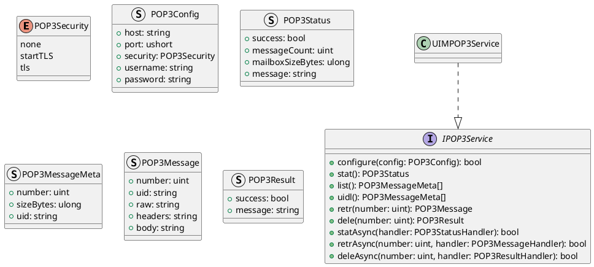
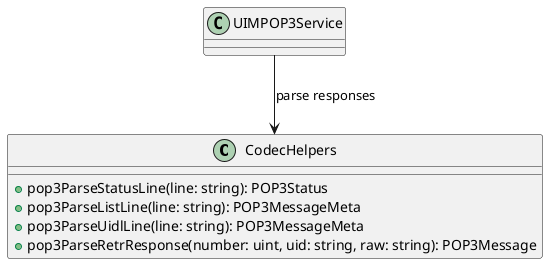
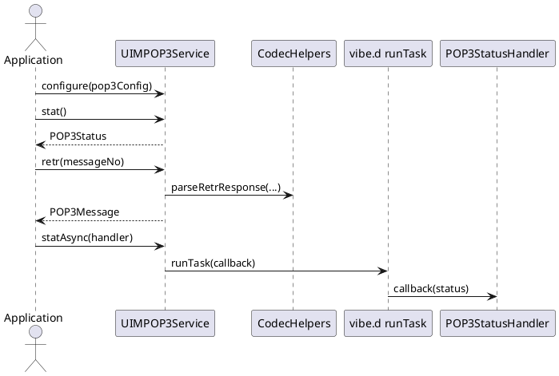

# UIM-POP3 UML Description

## Overview

The UIM-POP3 library provides a compact architecture for POP3 mailbox workflows in D. It combines typed contracts, parser helpers, model constructors, and service-level orchestration with asynchronous callback support using vibe.d.

## Core Types

## Helper Layer

## Sequence

