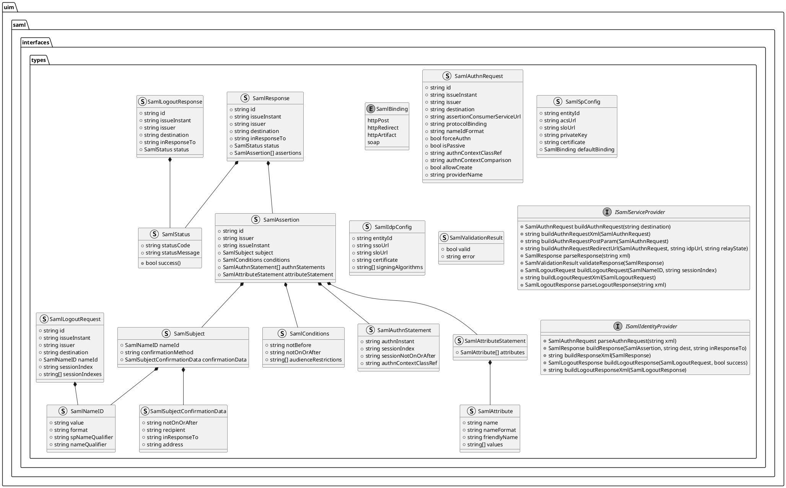
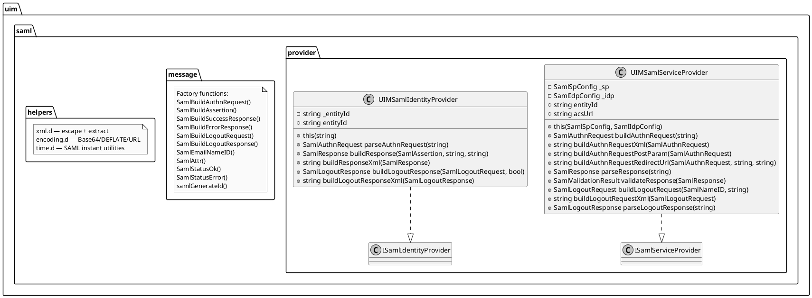
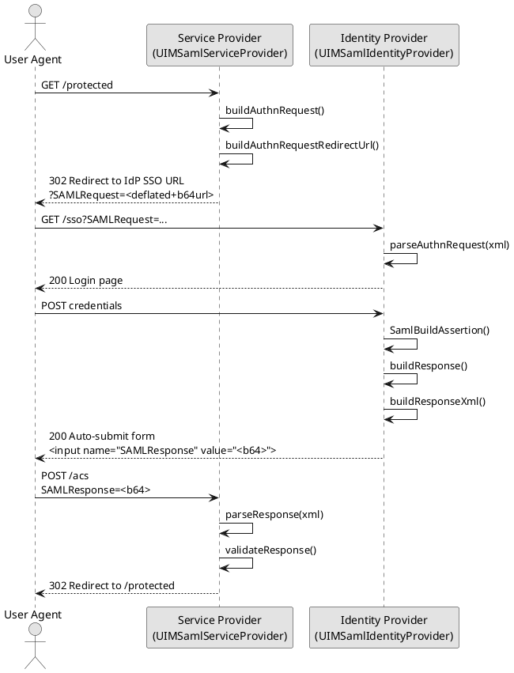
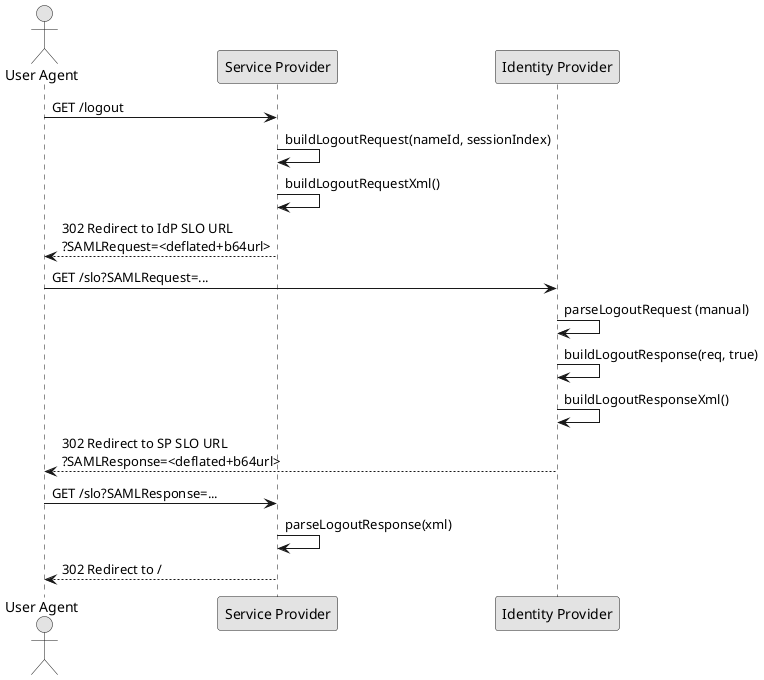

# UML — uim-saml

## Type Diagram

```plantuml
@startuml uim_saml_types
skinparam monochrome true
skinparam shadowing false

package "uim.saml.interfaces.types" {

  enum SamlBinding {
    httpPost
    httpRedirect
    httpArtifact
    soap
  }

  struct SamlNameID {
    + string value
    + string format
    + string spNameQualifier
    + string nameQualifier
  }

  struct SamlAttribute {
    + string name
    + string nameFormat
    + string friendlyName
    + string[] values
  }

  struct SamlSubjectConfirmationData {
    + string notOnOrAfter
    + string recipient
    + string inResponseTo
    + string address
  }

  struct SamlSubject {
    + SamlNameID nameId
    + string confirmationMethod
    + SamlSubjectConfirmationData confirmationData
  }

  struct SamlConditions {
    + string notBefore
    + string notOnOrAfter
    + string[] audienceRestrictions
  }

  struct SamlAuthnStatement {
    + string authnInstant
    + string sessionIndex
    + string sessionNotOnOrAfter
    + string authnContextClassRef
  }

  struct SamlAttributeStatement {
    + SamlAttribute[] attributes
  }

  struct SamlAssertion {
    + string id
    + string issuer
    + string issueInstant
    + SamlSubject subject
    + SamlConditions conditions
    + SamlAuthnStatement[] authnStatements
    + SamlAttributeStatement attributeStatement
  }

  struct SamlStatus {
    + string statusCode
    + string statusMessage
    + bool success()
  }

  struct SamlAuthnRequest {
    + string id
    + string issueInstant
    + string issuer
    + string destination
    + string assertionConsumerServiceUrl
    + string protocolBinding
    + string nameIdFormat
    + bool forceAuthn
    + bool isPassive
    + string authnContextClassRef
    + string authnContextComparison
    + bool allowCreate
    + string providerName
  }

  struct SamlResponse {
    + string id
    + string issueInstant
    + string issuer
    + string destination
    + string inResponseTo
    + SamlStatus status
    + SamlAssertion[] assertions
  }

  struct SamlLogoutRequest {
    + string id
    + string issueInstant
    + string issuer
    + string destination
    + SamlNameID nameId
    + string sessionIndex
    + string[] sessionIndexes
  }

  struct SamlLogoutResponse {
    + string id
    + string issueInstant
    + string issuer
    + string destination
    + string inResponseTo
    + SamlStatus status
  }

  struct SamlSpConfig {
    + string entityId
    + string acsUrl
    + string sloUrl
    + string privateKey
    + string certificate
    + SamlBinding defaultBinding
  }

  struct SamlIdpConfig {
    + string entityId
    + string ssoUrl
    + string sloUrl
    + string certificate
    + string[] signingAlgorithms
  }

  struct SamlValidationResult {
    + bool valid
    + string error
  }

  interface ISamlServiceProvider {
    + SamlAuthnRequest buildAuthnRequest(string destination)
    + string buildAuthnRequestXml(SamlAuthnRequest)
    + string buildAuthnRequestPostParam(SamlAuthnRequest)
    + string buildAuthnRequestRedirectUrl(SamlAuthnRequest, string idpUrl, string relayState)
    + SamlResponse parseResponse(string xml)
    + SamlValidationResult validateResponse(SamlResponse)
    + SamlLogoutRequest buildLogoutRequest(SamlNameID, string sessionIndex)
    + string buildLogoutRequestXml(SamlLogoutRequest)
    + SamlLogoutResponse parseLogoutResponse(string xml)
  }

  interface ISamlIdentityProvider {
    + SamlAuthnRequest parseAuthnRequest(string xml)
    + SamlResponse buildResponse(SamlAssertion, string dest, string inResponseTo)
    + string buildResponseXml(SamlResponse)
    + SamlLogoutResponse buildLogoutResponse(SamlLogoutRequest, bool success)
    + string buildLogoutResponseXml(SamlLogoutResponse)
  }

  SamlAssertion  *-- SamlSubject
  SamlAssertion  *-- SamlConditions
  SamlAssertion  *-- SamlAuthnStatement
  SamlAssertion  *-- SamlAttributeStatement
  SamlSubject    *-- SamlNameID
  SamlSubject    *-- SamlSubjectConfirmationData
  SamlResponse   *-- SamlStatus
  SamlResponse   *-- SamlAssertion
  SamlLogoutRequest  *-- SamlNameID
  SamlLogoutResponse *-- SamlStatus
  SamlAttributeStatement *-- SamlAttribute
}
@enduml
```

---

## Class Diagram

```plantuml
@startuml uim_saml_classes
skinparam monochrome true
skinparam shadowing false

package "uim.saml.provider" {

  class UIMSamlServiceProvider {
    - SamlSpConfig _sp
    - SamlIdpConfig _idp
    + this(SamlSpConfig, SamlIdpConfig)
    + string entityId
    + string acsUrl
    + SamlAuthnRequest buildAuthnRequest(string)
    + string buildAuthnRequestXml(SamlAuthnRequest)
    + string buildAuthnRequestPostParam(SamlAuthnRequest)
    + string buildAuthnRequestRedirectUrl(SamlAuthnRequest, string, string)
    + SamlResponse parseResponse(string)
    + SamlValidationResult validateResponse(SamlResponse)
    + SamlLogoutRequest buildLogoutRequest(SamlNameID, string)
    + string buildLogoutRequestXml(SamlLogoutRequest)
    + SamlLogoutResponse parseLogoutResponse(string)
  }

  class UIMSamlIdentityProvider {
    - string _entityId
    + this(string)
    + string entityId
    + SamlAuthnRequest parseAuthnRequest(string)
    + SamlResponse buildResponse(SamlAssertion, string, string)
    + string buildResponseXml(SamlResponse)
    + SamlLogoutResponse buildLogoutResponse(SamlLogoutRequest, bool)
    + string buildLogoutResponseXml(SamlLogoutResponse)
  }

  UIMSamlServiceProvider  ..|> ISamlServiceProvider
  UIMSamlIdentityProvider ..|> ISamlIdentityProvider
}

package "uim.saml.message" {
  note "Factory functions:\nSamlBuildAuthnRequest()\nSamlBuildAssertion()\nSamlBuildSuccessResponse()\nSamlBuildErrorResponse()\nSamlBuildLogoutRequest()\nSamlBuildLogoutResponse()\nSamlEmailNameID()\nSamlAttr()\nSamlStatusOk()\nSamlStatusError()\nsamlGenerateId()" as N1
}

package "uim.saml.helpers" {
  note "xml.d — escape + extract\nencoding.d — Base64/DEFLATE/URL\ntime.d — SAML instant utilities" as N2
}
@enduml
```

---

## SSO Sequence Diagram

```plantuml
@startuml uim_saml_sso_sequence
skinparam monochrome true

actor       "User Agent" as UA
participant "Service Provider\n(UIMSamlServiceProvider)" as SP
participant "Identity Provider\n(UIMSamlIdentityProvider)" as IdP

UA  -> SP : GET /protected
SP  -> SP : buildAuthnRequest()
SP  -> SP : buildAuthnRequestRedirectUrl()
SP  --> UA : 302 Redirect to IdP SSO URL\n?SAMLRequest=<deflated+b64url>

UA  -> IdP : GET /sso?SAMLRequest=...
IdP -> IdP : parseAuthnRequest(xml)
IdP --> UA : 200 Login page

UA  -> IdP : POST credentials
IdP -> IdP : SamlBuildAssertion()
IdP -> IdP : buildResponse()
IdP -> IdP : buildResponseXml()
IdP --> UA : 200 Auto-submit form\n<input name="SAMLResponse" value="<b64>">

UA  -> SP : POST /acs\nSAMLResponse=<b64>
SP  -> SP : parseResponse(xml)
SP  -> SP : validateResponse()
SP  --> UA : 302 Redirect to /protected
@enduml
```

---

## SLO Sequence Diagram

```plantuml
@startuml uim_saml_slo_sequence
skinparam monochrome true

actor "User Agent" as UA
participant "Service Provider" as SP
participant "Identity Provider" as IdP

UA  -> SP  : GET /logout
SP  -> SP  : buildLogoutRequest(nameId, sessionIndex)
SP  -> SP  : buildLogoutRequestXml()
SP  --> UA : 302 Redirect to IdP SLO URL\n?SAMLRequest=<deflated+b64url>

UA  -> IdP : GET /slo?SAMLRequest=...
IdP -> IdP : parseLogoutRequest (manual)
IdP -> IdP : buildLogoutResponse(req, true)
IdP -> IdP : buildLogoutResponseXml()
IdP --> UA : 302 Redirect to SP SLO URL\n?SAMLResponse=<deflated+b64url>

UA  -> SP  : GET /slo?SAMLResponse=...
SP  -> SP  : parseLogoutResponse(xml)
SP  --> UA : 302 Redirect to /
@enduml
```
