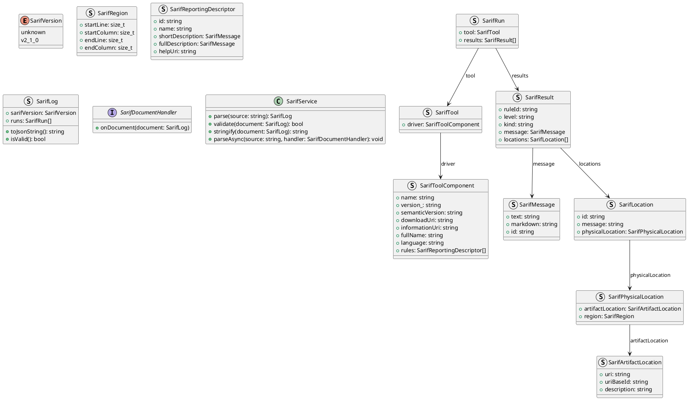
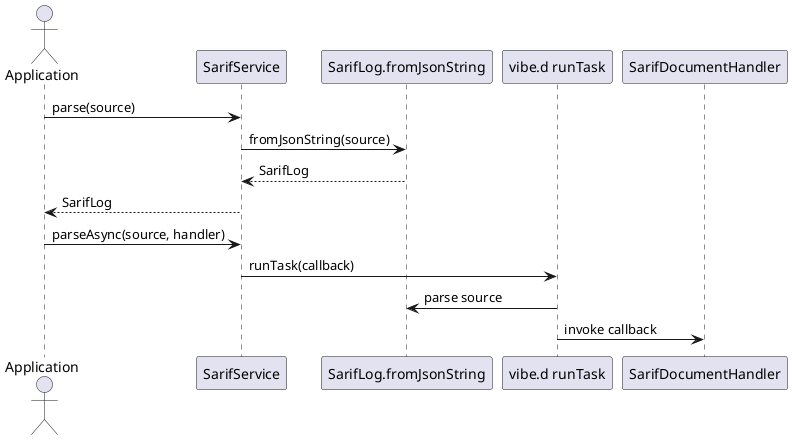

# UIM-SARIF UML Description

## Overview

The UIM-SARIF library provides a practical SARIF 2.1.0 model for D applications, with JSON round-tripping and a vibe.d-friendly service layer.

## Core Types

## Sequence

