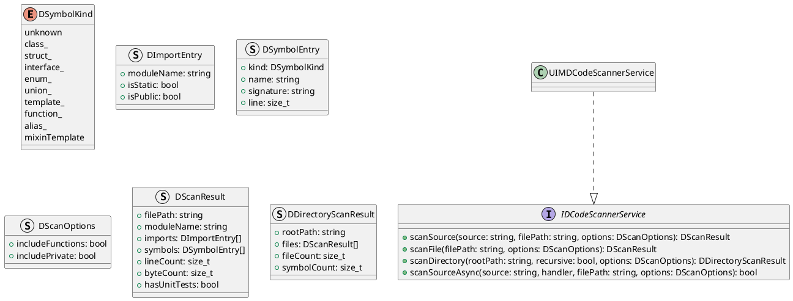
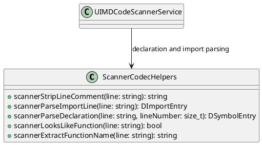
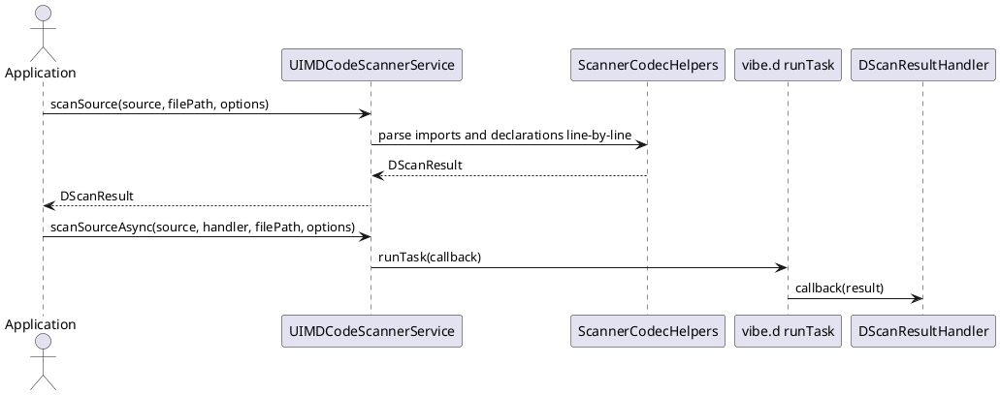

# UIM-SCANNER UML Description

## Overview

UIM-SCANNER provides a compact D source scanning architecture for metadata extraction from files and source strings.

## Core Types

## Helper Layer

## Sequence

