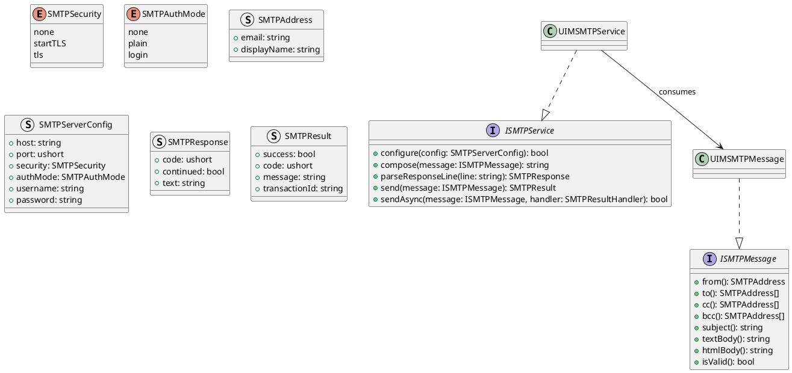
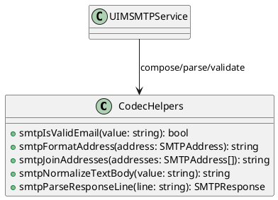
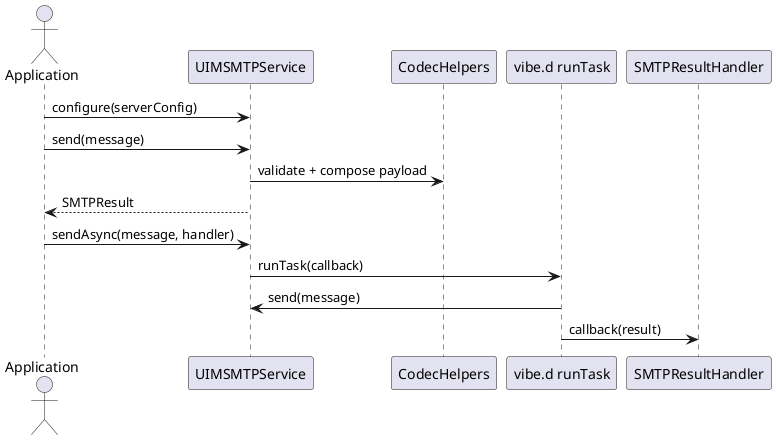

# UIM-SMTP UML Description

## Overview

The UIM-SMTP library provides a compact architecture for building SMTP message flows in D. It combines typed contracts, composable message models, helper codecs, and service-level orchestration with asynchronous callback support using vibe.d.

## Core Types

## Helper Layer

## Sequence

