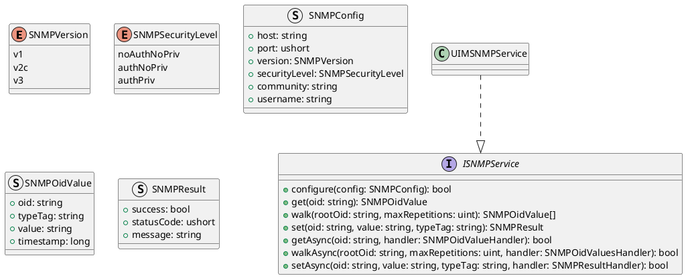
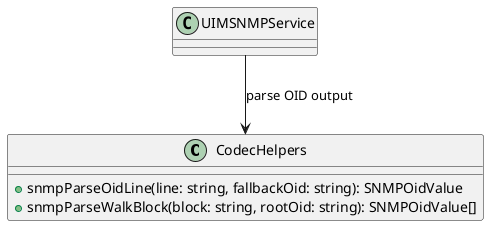
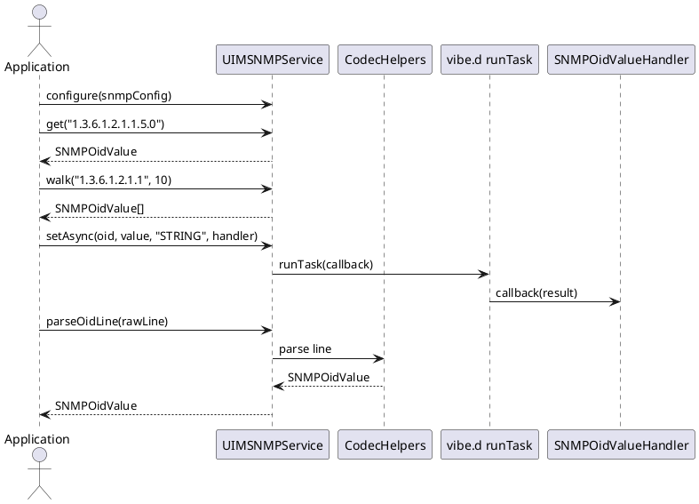

# UIM-SNMP UML Description

## Overview

The UIM-SNMP library provides a compact architecture for SNMP workflows in D. It combines typed contracts, parser helpers, model constructors, and service-level orchestration with asynchronous callback support using vibe.d.

## Core Types

## Helper Layer

## Sequence

