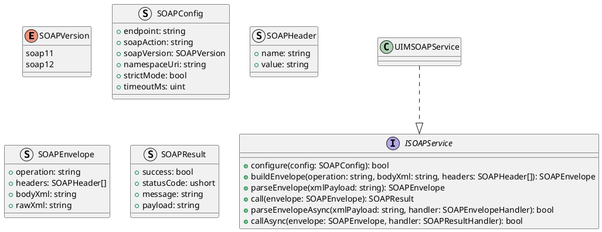
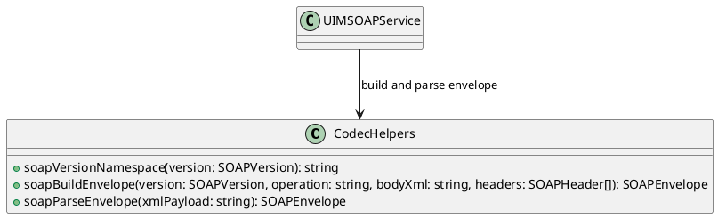
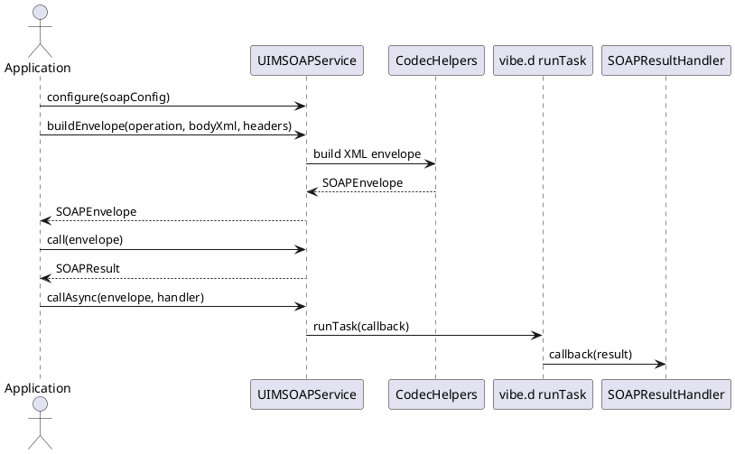

# UIM-SOAP UML Description

## Overview

The UIM-SOAP library provides a compact architecture for SOAP workflows in D. It combines typed contracts, envelope helpers, model constructors, and service-level orchestration with asynchronous callback support using vibe.d.

## Core Types

## Helper Layer

## Sequence

