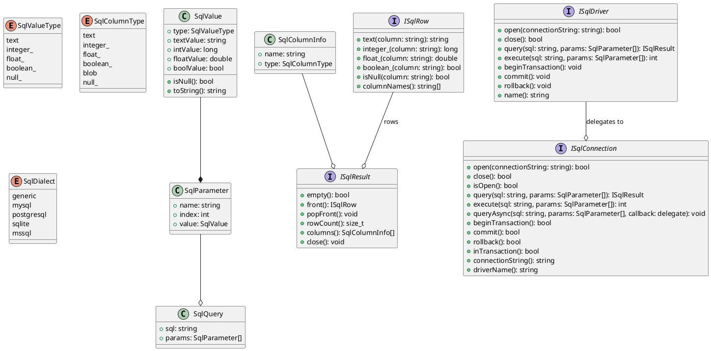
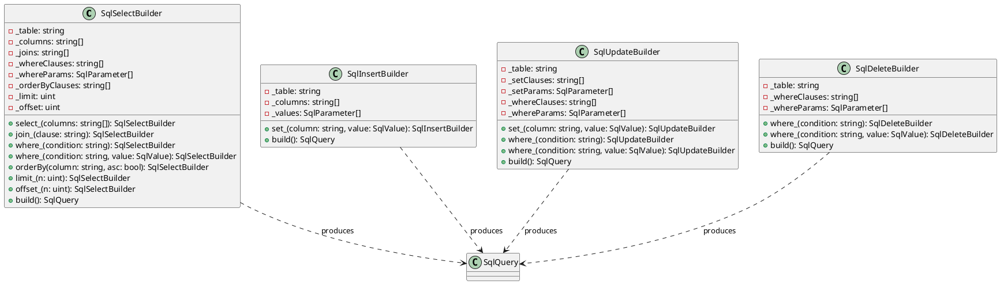
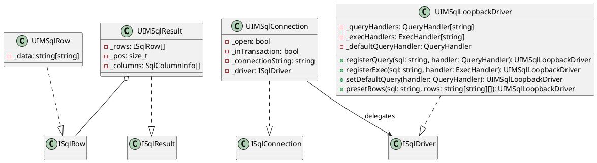
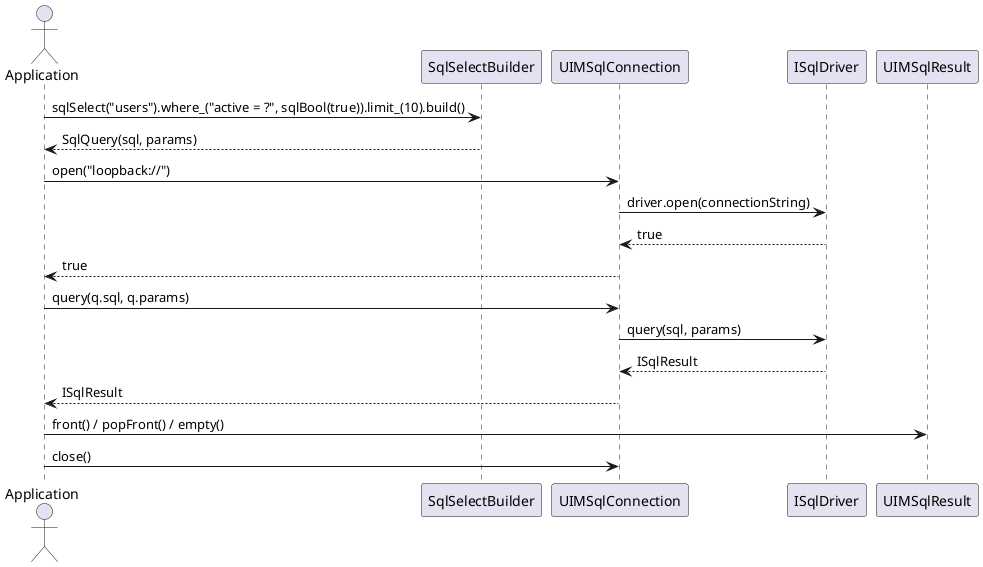

/****************************************************************************************************************
* Copyright: © 2018-2026 Ozan Nurettin Suel (aka UI-Manufaktur UG *R.I.P*)
* License: Subject to the terms of the Apache 2.0 license, as written in the included LICENSE.txt file.
* Authors: Ozan Nurettin Suel (aka UI-Manufaktur UG *R.I.P*)
*****************************************************************************************************************/

# UIM-SQL UML Description

## Overview
The UIM-SQL library is a three-tier SQL toolkit: a dialect-aware query builder produces parameterised SQL, a driver interface abstracts the underlying connection, and an in-process loopback driver enables testing without a live database.

## Core Contracts

## Query Builder Layer

## Implementation Layer

## Query Execution Sequence

