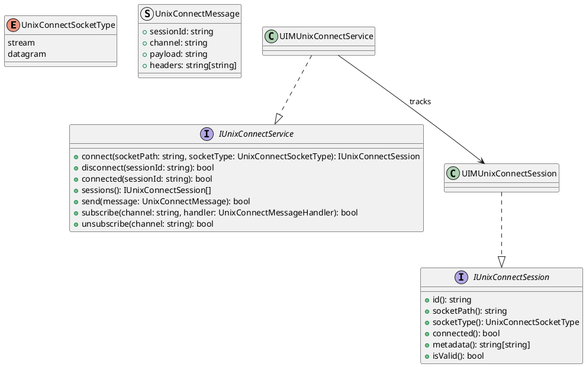
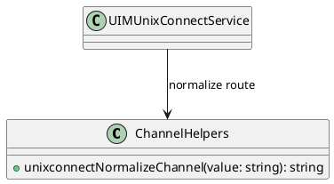
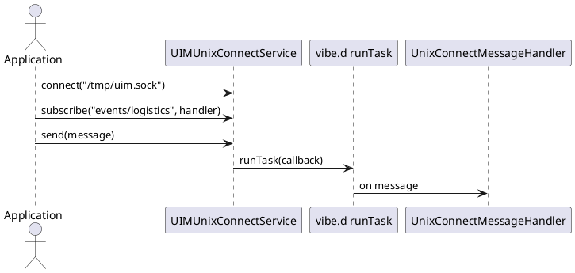

# UIM-UNIXCONNECT UML Description

## Overview

The UIM-UNIXCONNECT library provides a compact architecture for UNIX-CONNECT style IPC messaging in D applications with vibe.d asynchronous callback dispatch.

## Core Types

## Helper Layer

## Sequence

