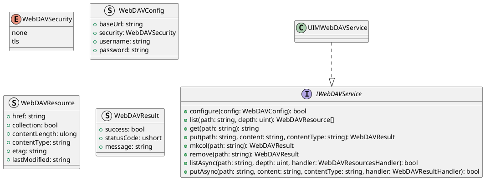
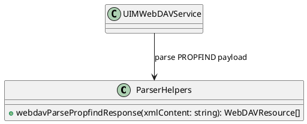
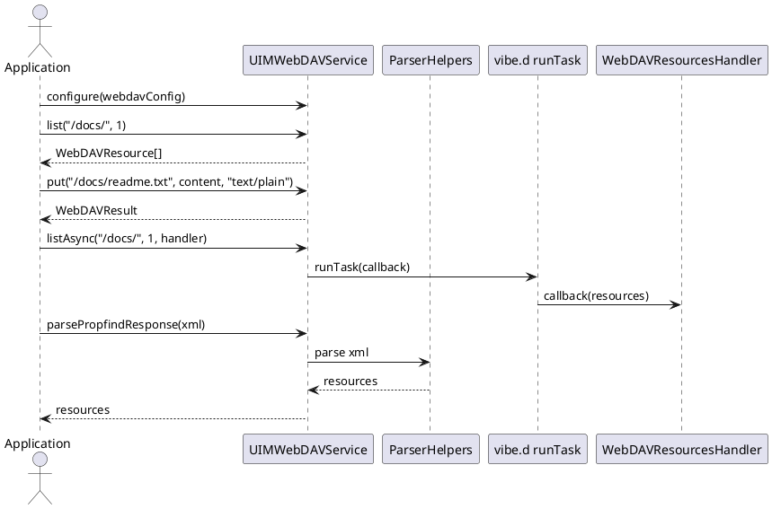

# UIM-WEBDAV UML Description

## Overview

The UIM-WEBDAV library provides a compact architecture for WebDAV resource workflows in D. It combines typed contracts, parser helpers, result model constructors, and service-level orchestration with asynchronous callback support using vibe.d.

## Core Types

## Helper Layer

## Sequence

