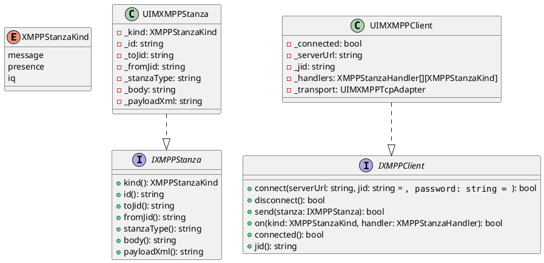
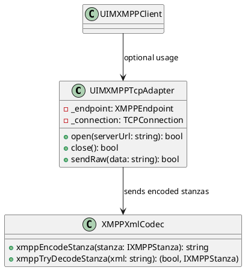
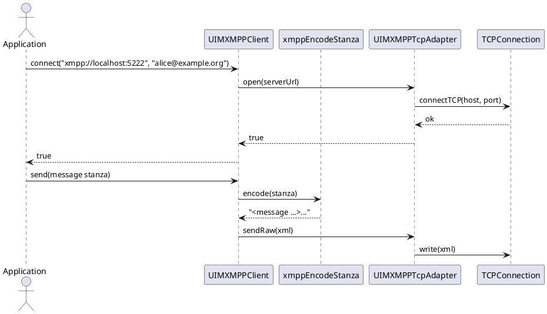

/****************************************************************************************************************
* Copyright: © 2018-2026 Ozan Nurettin Süel (aka UI-Manufaktur UG *R.I.P*)
* License: Subject to the terms of the Apache 2.0 license, as written in the included LICENSE.txt file.
* Authors: Ozan Nurettin Süel (aka UI-Manufaktur UG *R.I.P*)
*****************************************************************************************************************/

# UIM-XMPP UML Description

## Overview
The UIM-XMPP library provides a compact architecture for building XMPP clients in D. It combines a typed stanza API, XML helpers, and an optional TCP transport adapter based on vibe-core networking.

## Core Types

## Transport Layer

## Sequence

